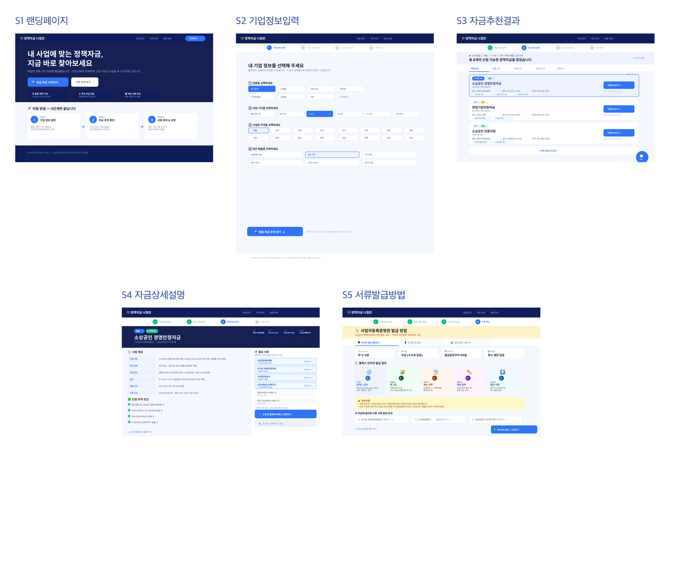
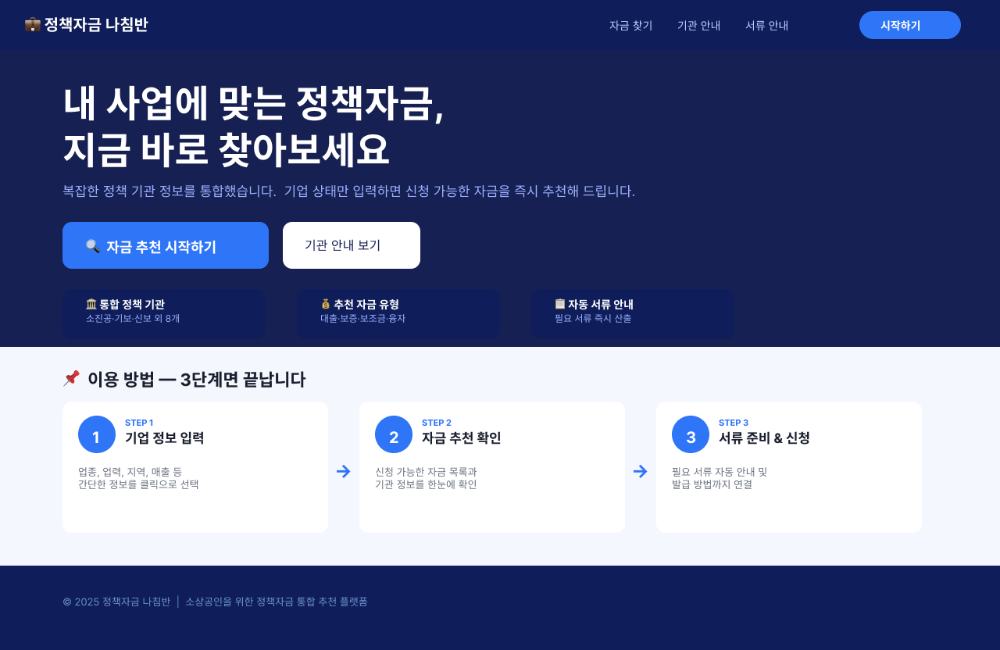
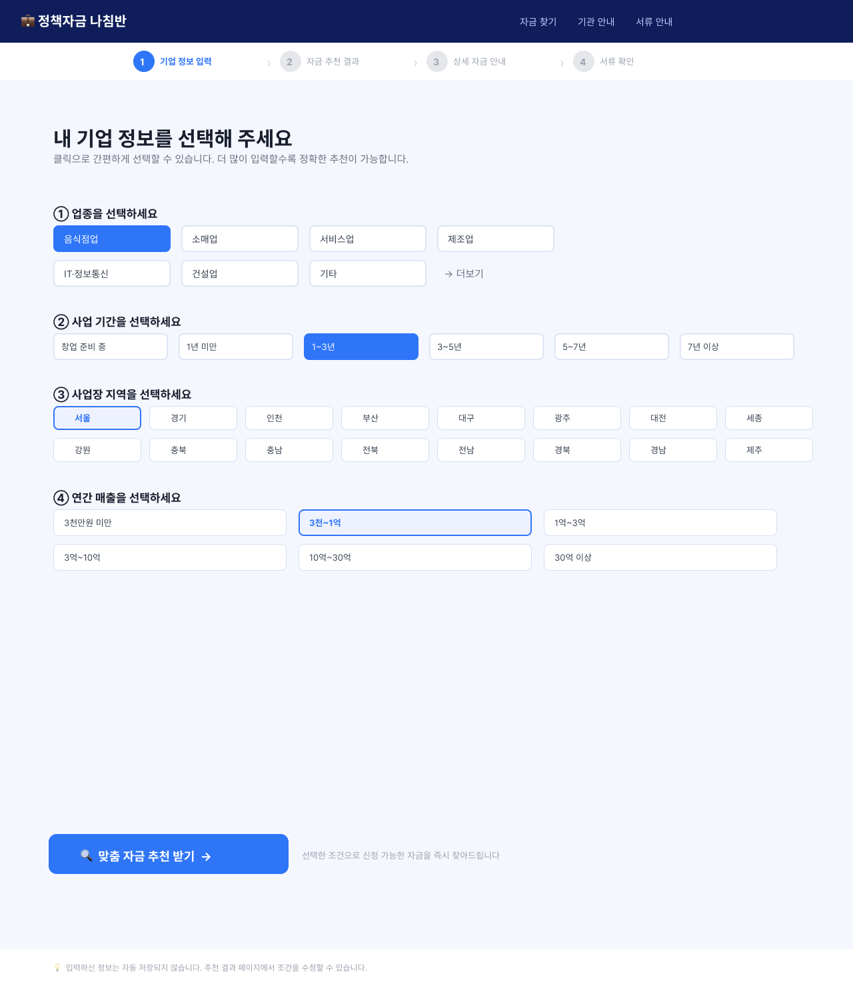
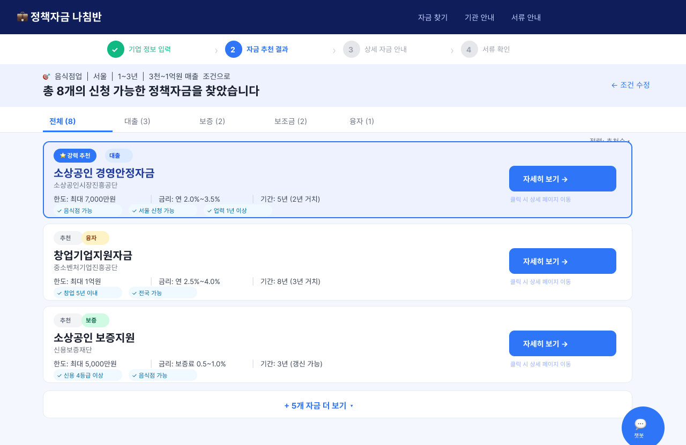
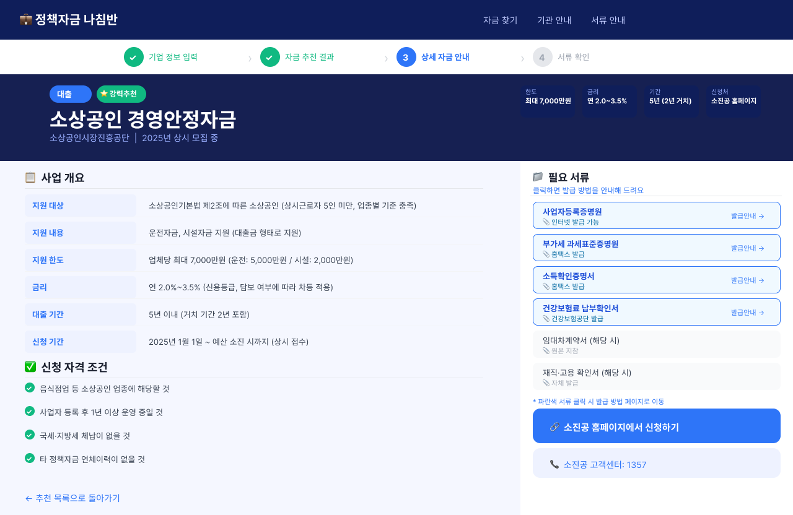
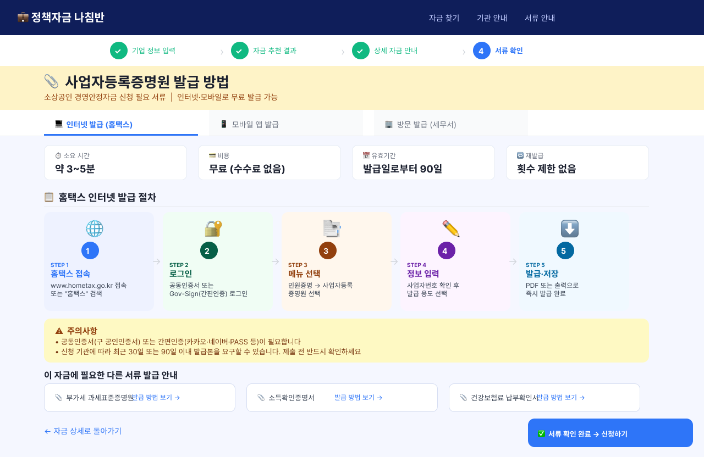

# 01. 서비스 스토리보드 가이드

정책자금 추천 웹사이트의 스토리보드 흐름을 빠르게 이해하기 위한 안내 문서입니다. 이 문서는 사용자가 제공한 스토리보드 PNG 이미지를 기준으로 각 화면의 역할, 주요 UI, 사용자 관점의 의미를 정리합니다.

## 원본 링크

- 디자인 파일: [정책자금 추천 웹사이트 (Figma Design)](https://www.figma.com/design/Sjn2fISSCSX8vk35bLpV7r/%EC%A0%95%EC%B1%85%EC%9E%90%EA%B8%88-%EC%B6%94%EC%B2%9C-%EC%9B%B9%EC%82%AC%EC%9D%B4%ED%8A%B8?node-id=0-1&p=f)
- 프로토타입: [정책자금 추천 웹사이트 (Figma Prototype)](https://www.figma.com/proto/Sjn2fISSCSX8vk35bLpV7r/%EC%A0%95%EC%B1%85%EC%9E%90%EA%B8%88-%EC%B6%94%EC%B2%9C-%EC%9B%B9%EC%82%AC%EC%9D%B4%ED%8A%B8?node-id=3-410&p=f&t=pG8Cgm8uxp0ogFAh-0&scaling=min-zoom&content-scaling=fixed&page-id=0%3A1&starting-point-node-id=3%3A2)

## 참고 사항

- 확인 기준일: `2026-04-30`
- 인앱 브라우저 기준으로 프로토타입 URL은 Figma 이메일 인증 페이지로 리디렉션되었습니다.
- 아래 이미지는 사용자가 제공한 `S1`~`S5` PNG 캡처 파일을 기준으로 정리했습니다.

## 전체 흐름

사용자 여정은 아래 순서로 이어집니다.

1. `S1`에서 서비스의 목적과 기대 효과를 이해한다.
2. `S2`에서 기업 상태를 입력한다.
3. `S3`에서 추천된 정책자금 목록을 확인한다.
4. `S4`에서 개별 자금의 상세 조건을 검토한다.
5. `S5`에서 실제 신청 전 필요한 서류 발급 방법을 확인한다.

## S1. 랜딩페이지

### 화면 목적

첫 화면에서 서비스의 정체성을 설명하고, 사용자가 추천 플로우로 자연스럽게 진입하도록 만드는 역할입니다.

### 핵심 이해 포인트

- 정책자금 추천 서비스라는 점을 첫 인상에서 전달합니다.
- 사용자가 입력만 하면 추천부터 서류 준비까지 이어진다는 기대를 만듭니다.
- `시작하기` 버튼이 추천 여정의 진입 CTA입니다.

### 주요 UI 요소

- 상단 내비게이션
- 메인 소개 영역
- `시작하기` 버튼
- 추천부터 서류 준비까지의 단계 설명 카드

## S2. 기업정보입력

### 화면 목적

정책자금 추천 정확도를 높이기 위해 사용자의 기업 상태를 구조화된 선택값으로 수집하는 단계입니다.

### 핵심 이해 포인트

- 사용자는 복잡한 서술 대신 버튼형 선택지로 정보를 빠르게 입력합니다.
- 많이 입력할수록 추천 결과가 정교해진다는 메시지가 중요합니다.
- 입력 항목은 추천 로직의 핵심 조건값으로 바로 연결됩니다.

### 주요 입력 항목

- 업종
- 사업 기간
- 사업장 지역
- 연간 매출

### 기대 UX

- 폼이라기보다 상태 선택형 필터 경험에 가깝습니다.
- 입력 부담을 줄이고, 클릭 몇 번으로 결과 화면까지 이동하게 만드는 구조입니다.

## S3. 자금추천결과

### 화면 목적

입력한 기업 정보에 맞는 정책자금 목록을 보여주고, 사용자가 우선 검토할 자금을 빠르게 좁히도록 돕는 단계입니다.

### 핵심 이해 포인트

- 사용자의 현재 조건으로 신청 가능한 자금 수를 한눈에 보여줍니다.
- 목록은 단순 나열이 아니라 `강력 추천`, `대출`, `보증`, `보조금` 등으로 읽기 쉽게 분류됩니다.
- 각 카드에는 한도, 금리, 기간, 지역/업력 같은 핵심 조건이 요약되어 있습니다.

### 주요 UI 요소

- 추천 결과 개수 표시
- 카테고리 탭
- 추천 카드 리스트
- 카드별 핵심 조건 요약

### 사용자 행동

이 화면의 다음 행동은 `관심 있는 자금을 선택해 상세 설명으로 이동`하는 것입니다.

## S4. 자금상세설명

### 화면 목적

개별 정책자금 하나를 깊게 검토하는 단계입니다. 사용자는 여기서 실제 신청 가치가 있는지 판단합니다.

### 핵심 이해 포인트

- 목록 화면의 요약 정보를 상세 기준으로 확장합니다.
- 자격 조건, 지원 내용, 신청 포인트, 준비 항목을 구체적으로 확인할 수 있어야 합니다.
- 결과 확인에서 실제 행동으로 넘어가는 브리지 역할을 합니다.

### 주요 UI 요소

- 자금명 및 기본 정보
- 자격/조건 상세 영역
- 신청 관련 안내
- 우측 액션 패널 또는 다음 단계 버튼 영역

### 사용자 행동

상세 내용을 검토한 뒤, 필요 서류 확인이나 발급 안내 단계로 이동합니다.

## S5. 서류발급방법

### 화면 목적

신청 직전 사용자가 가장 막히기 쉬운 `필요 서류 준비`를 돕는 단계입니다. 추천 서비스가 실제 신청 실행까지 연결된다는 점을 보여줍니다.

### 핵심 이해 포인트

- 필요한 증빙 종류를 단순 나열하는 것이 아니라, 어떻게 발급받는지 단계별로 안내합니다.
- 발급 가능 시간, 수수료, 유효기간 같은 실무 정보가 중요합니다.
- 사용자는 여기서 외부 발급 사이트나 후속 신청 흐름으로 이동할 준비를 합니다.

### 주요 UI 요소

- 발급 대상 서류 안내
- 단계별 발급 절차
- 주의사항 및 발급 조건
- 실제 발급 페이지로 연결되는 CTA

## 화면 요약

| 화면 | 역할 | 사용자의 질문 |
| --- | --- | --- |
| `S1` | 서비스 소개 및 진입 | "이 서비스가 나에게 어떤 도움을 주는가?" |
| `S2` | 기업 상태 입력 | "내 기업 상황을 어떻게 전달하면 되는가?" |
| `S3` | 추천 결과 탐색 | "내가 신청할 수 있는 자금은 무엇인가?" |
| `S4` | 개별 자금 검토 | "이 자금이 실제로 나에게 맞는가?" |
| `S5` | 서류 준비 안내 | "신청 전에 어떤 서류를 어떻게 준비해야 하는가?" |

## 제품 해석

이 스토리보드는 단순 정보 제공형 페이지 묶음이 아니라, 아래의 문제를 끊김 없이 해결하려는 구조로 읽힙니다.

- 사용자는 정책자금을 잘 모른다.
- 그래서 먼저 상태 입력으로 맥락을 수집한다.
- 추천 결과로 선택지를 좁힌다.
- 상세 설명으로 판단을 돕는다.
- 마지막으로 서류 준비까지 연결해 실제 신청 실행 가능성을 높인다.

즉, 이 제품의 핵심 가치는 `정책자금 탐색의 복잡성`을 줄이고 `추천에서 실행까지의 이탈`을 최소화하는 데 있습니다.
