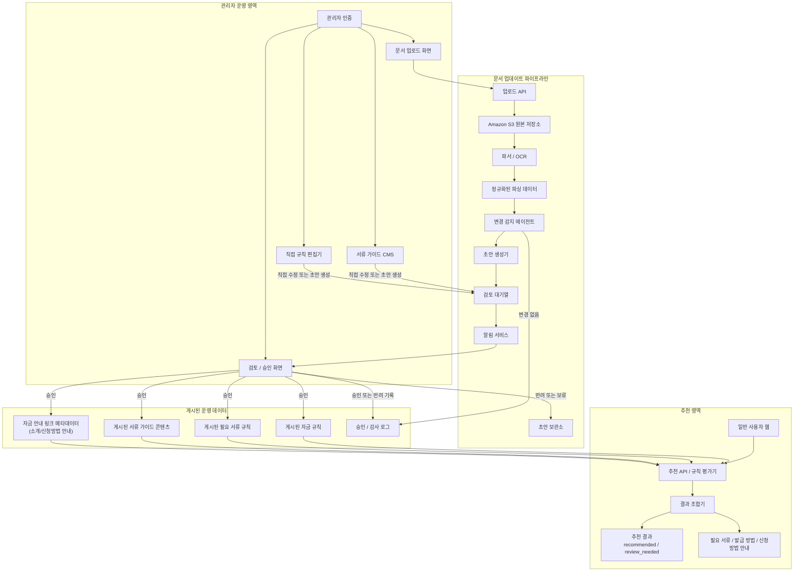

# 03. 시스템 아키텍처

## 현재 적용 흐름 — 2026-09-18

수집·가공 경계와 첫 실증은 [16_RAW_수집_가공_분리_설계.md](16_RAW_수집_가공_분리_설계.md), 후속 대화 흐름은 [15_대화형_정책자금_안내_전환계획.md](15_대화형_정책자금_안내_전환계획.md)를 기준으로 한다.

1. 기관 URL·수집 범위·허용 도메인·RAW 메타데이터를 설정한다. 정책자금 스키마는 아직 정하지 않는다.
2. 개발 Agent가 Playwright MCP로 사이트를 확인해 수집 코드·기관별 어댑터·테스트를 작성한다. 이후 정상 수집에서는 검증된 코드가 매번 목록을 탐색하고 HTML/DOM·본문·PDF/HWP 원본을 확보한다.
3. 공고 ID·본문/첨부 해시로 신규/변경본을 구분해 S3 RAW에 원본·메타데이터·불변 버전을 저장한다. 파일 업로드 후 완료 manifest를 발행하면 수집 작업은 끝난다.
4. 별도 가공 작업에서 두 번째 Agent가 S3 완료본을 읽고 이 단계의 정책자금 스키마로 추출한다. 코드 검증 후 Snowflake STAGING에 적재한다. 실패는 원본을 유지한 채 제한된 재처리 또는 운영 검토로 보낸다.
5. 검토·승인된 데이터는 CURATED의 게시 버전으로 관리하고 Semantic Views에 연결한다.
6. 사용자가 프롬프트로 자금을 물으면 대화 Agent가 부족한 기업 상태를 질문한다.
7. 확인된 상태로 게시 데이터를 조회·비교하고 근거와 미확인 조건을 포함해 답변한다.

개발·유지보수 Agent, 수집 실행 코드, 가공 Agent, 대화 Agent는 역할·권한을 구분한다. 정상 RAW 수집은 LLM·MCP·Codex 앱·Snowflake나 가공 성공에 의존하지 않는다. 실패 증거를 바탕으로 AI가 수정안을 만들 수 있지만 테스트와 승인 없이 운영 코드를 교체하지 않는다. 시멘틱 레이어는 데이터의 의미와 조회 기준을 정의하고, 질문 순서와 대화 상태는 대화 Agent가 담당한다. 검증 PASS는 게시 승인이 아니며, 대화에서 미확인 조건을 충족으로 취급하지 않는다.

개발 작업은 [구현 지시서](tasks/01_collector_mvp.md), 실행과 장애 대응은 [운영 안내](runbooks/collector.md)를 따른다. 문서는 AI의 작업 기준이고, 수집 실행 시에는 코드가 기관별 설정을 읽는다.

Airflow는 단일 URL 수집 실증 이후에 연결한다. `policy_fund_ingestion`은 탐색·신규/변경·S3 저장, `policy_fund_processing`은 완료 RAW의 정형화·검증·저장을 실행하는 독립 작업이다. `policy_fund_matching`은 기업 프로필의 정기 재평가가 필요할 때 도입할 후속 배치이며, 초기 대화 요청별 매칭의 필수 구성은 아니다.

## 이전 웹서비스 아키텍처 — 후속 구현 참고

아래 업로드·추천 API 중심 흐름은 이전 설계다. 수동 업로드는 보조 입력 경로로 재사용할 수 있으며, 기존 추천 UI/API는 초기 구현의 선행조건이 아니다.

기능요구사항과 운영 의사결정을 반영한 MVP 기준 시스템 아키텍처입니다. 이 문서는 `무슨 흐름이 있는가`를 설명하는 상위 구조 문서이며, `무엇으로 어떻게 구현할 것인가`는 [04_기술_아키텍처.md](/Users/jeehun/Documents/GitHub/Government-backed funding/docs/04_기술_아키텍처.md)에서 다룹니다.

핵심은 `문서 업로드 -> 파싱 -> 변경 감지 -> 초안 생성 -> 관리자 검토 알림 -> 승인 반영` 워크플로우와, 승인된 운영 데이터만 참조하는 추천 엔진입니다.

## 핵심 원칙

- 추천 서비스는 승인 후 반영된 운영 데이터만 참조합니다.
- 운영 데이터는 `정책자금 규칙`, `필요 서류 규칙`, `서류 발급 가이드`, `자금 안내 링크` 도메인으로 분리합니다.
- 업로드 문서에서 추출된 초안은 직접 운영 반영되지 않고 반드시 검토 큐와 승인 단계를 거칩니다.
- 관리자 기능은 인증된 관리자만 접근할 수 있어야 합니다.
- `신용점수`, `기대출` 같은 민감 입력값은 MVP에서 추천 평가용으로만 사용하고 raw 값 영구 저장은 기본 요구사항에서 제외합니다.
- 챗봇과 RAG 검색은 `MVP 이후` 확장 영역으로 분리합니다.

## 주요 흐름

### 1. 규칙 업데이트 및 승인

1. 관리자가 공고문 또는 기관 안내문을 업로드합니다.
2. 시스템이 문서를 파싱하고 정규화된 텍스트를 생성합니다.
3. 변경 감지 에이전트가 기존 운영 데이터와 비교해 차이 여부를 판단합니다.
4. 변경이 있으면 자금 규칙, 필요 서류 규칙, 서류 가이드, 자금 안내 링크에 대한 초안 변경안을 만듭니다.
5. 시스템이 관리자에게 검토 알림을 보냅니다.
6. 관리자가 승인, 반려, 수정 후 승인을 수행합니다.
7. 승인된 변경만 운영 데이터로 반영됩니다.

### 2. 사용자 추천

1. 사용자가 선택/검색 중심 UI로 기업 정보를 입력합니다.
2. 추천 API가 승인된 운영 데이터만 조회합니다.
3. 규칙 평가기가 자금별 `recommended`, `review_needed`, `not_applicable` 내부 상태를 계산합니다.
4. 결과 조합기가 우선순위, 추천 근거, 필요 서류, 발급 가이드, 자금 소개/신청방법 안내 링크를 함께 조합합니다.
5. 사용자에게는 `recommended` 또는 `review_needed` 자금 카드와 후속 준비 정보를 반환합니다.

## 운영 메모

- `게시된 자금 규칙`은 자금별 자격 조건, 우선순위 계산 기준, 핵심 요약 정보를 포함하는 운영 규칙 저장소입니다.
- `게시된 필요 서류 규칙`은 자금 공통 서류와 조건부 서류 매핑을 담당합니다.
- `게시된 서류 가이드 콘텐츠`는 각 서류의 발급 방법, 유의사항, 실무 정보를 관리합니다.
- `자금 안내 링크 메타데이터`는 자금 소개 페이지, 공고문, 신청방법 안내 페이지 정보를 관리합니다.
- `승인 / 감사 로그`는 MVP에서 최소 `updated_at`, `updated_by`, `approved_at`, `approved_by` 수준의 기록을 남기는 것을 전제로 합니다.
- `알림 서비스`는 이메일, 슬랙, 인앱 알림 중 하나 이상의 방식으로 구현할 수 있습니다.
