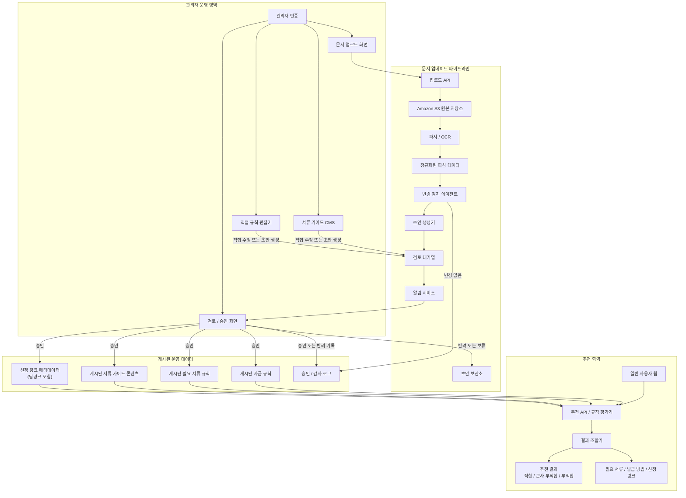

# 03. 시스템 아키텍처

기능요구사항과 운영 의사결정을 반영한 MVP 기준 시스템 아키텍처입니다. 이 문서는 `무슨 흐름이 있는가`를 설명하는 상위 구조 문서이며, `무엇으로 어떻게 구현할 것인가`는 [04_기술_아키텍처.md](/Users/jeehun/Documents/GitHub/Government-backed funding/docs/04_기술_아키텍처.md)에서 다룹니다.

핵심은 `문서 업로드 -> 파싱 -> 변경 감지 -> 초안 생성 -> 관리자 검토 알림 -> 승인 반영` 워크플로우와, 승인된 운영 데이터만 참조하는 추천 엔진입니다.

## 핵심 원칙

- 추천 서비스는 승인 후 반영된 운영 데이터만 참조합니다.
- 운영 데이터는 `정책자금 규칙`, `필요 서류 규칙`, `서류 발급 가이드`, `신청 링크` 도메인으로 분리합니다.
- 업로드 문서에서 추출된 초안은 직접 운영 반영되지 않고 반드시 검토 큐와 승인 단계를 거칩니다.
- 관리자 기능은 인증된 관리자만 접근할 수 있어야 합니다.
- `신용점수`, `기대출` 같은 민감 입력값은 MVP에서 추천 평가용으로만 사용하고 raw 값 영구 저장은 기본 요구사항에서 제외합니다.
- 챗봇과 RAG 검색은 `MVP 이후` 확장 영역으로 분리합니다.

## 주요 흐름

### 1. 규칙 업데이트 및 승인

1. 관리자가 공고문 또는 기관 안내문을 업로드합니다.
2. 시스템이 문서를 파싱하고 정규화된 텍스트를 생성합니다.
3. 변경 감지 에이전트가 기존 운영 데이터와 비교해 차이 여부를 판단합니다.
4. 변경이 있으면 자금 규칙, 필요 서류 규칙, 서류 가이드, 신청 링크에 대한 초안 변경안을 만듭니다.
5. 시스템이 관리자에게 검토 알림을 보냅니다.
6. 관리자가 승인, 반려, 수정 후 승인을 수행합니다.
7. 승인된 변경만 운영 데이터로 반영됩니다.

### 2. 사용자 추천

1. 사용자가 선택/검색 중심 UI로 기업 정보를 입력합니다.
2. 추천 API가 승인된 운영 데이터만 조회합니다.
3. 규칙 평가기가 자금별 `적합`, `근사 부적합`, `부적합` 상태를 계산합니다.
4. 결과 조합기가 우선순위, 추천 근거, 필요 서류, 발급 가이드, 신청 딥링크를 함께 조합합니다.
5. 사용자에게 추천 결과와 후속 준비 정보를 반환합니다.

## 운영 메모

- `게시된 자금 규칙`은 자금별 자격 조건, 우선순위 계산 기준, 핵심 요약 정보를 포함하는 운영 규칙 저장소입니다.
- `게시된 필요 서류 규칙`은 자금 공통 서류와 조건부 서류 매핑을 담당합니다.
- `게시된 서류 가이드 콘텐츠`는 각 서류의 발급 방법, 유의사항, 실무 정보를 관리합니다.
- `신청 링크 메타데이터`는 기관별 자금 신청 딥링크와 신청 채널 정보를 관리합니다.
- `승인 / 감사 로그`는 MVP에서 최소 `updated_at`, `updated_by`, `approved_at`, `approved_by` 수준의 기록을 남기는 것을 전제로 합니다.
- `알림 서비스`는 이메일, 슬랙, 인앱 알림 중 하나 이상의 방식으로 구현할 수 있습니다.
