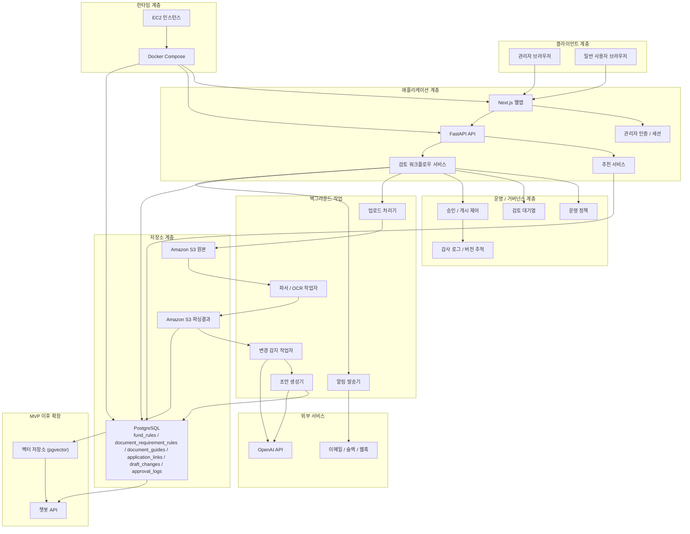

# 04. 기술 아키텍처

정책자금 추천 서비스의 MVP 기술 아키텍처 문서입니다. 이 문서는 [03_시스템_아키텍처.md](/Users/jeehun/Documents/GitHub/Government-backed funding/docs/03_시스템_아키텍처.md)에서 정의한 흐름을 `무엇으로 어떻게 구현할 것인가`를 설명하는 기준 문서입니다.

즉 `03`이 상위 시스템 흐름을 설명한다면, `04`는 기술 스택, 저장소, 작업자 프로세스, 운영 통제 방식을 구체화합니다.

## 권장 기술 스택

- 프론트엔드 / 관리자 콘솔: Next.js
- 백엔드 API: FastAPI
- 백그라운드 처리: 파싱, OCR, AI 추출, 변경 감지, 알림 발송용 작업자 프로세스
- 운영 데이터베이스: PostgreSQL
- 오브젝트 스토리지: Amazon S3
- LLM 처리: OpenAI API
- 관리자 인증: 세션 기반 관리자 인증
- 검토 대기열 / 게시 모델: PostgreSQL 기반 초안 검토 및 게시 워크플로우
- 알림 채널: 이메일, 슬랙, 웹훅
- 런타임: Docker Compose
- 최종 데모 배포: Amazon EC2
- MVP 이후 선택 확장: 챗봇 RAG용 pgvector

## 핵심 데이터 도메인

- `source_documents`: 업로드 원본 문서 메타데이터
- `parsed_documents`: 파싱 또는 정규화 결과 메타데이터
- `draft_changes`: AI가 제안한 규칙, 서류, 링크 변경 초안
- `fund_rules`: 승인된 정책자금 규칙
- `document_requirement_rules`: 자금과 사용자 조건 기반 필요 서류 매핑
- `document_guides`: 서류 발급 방법 콘텐츠
- `application_links`: 자금별 외부 신청 딥링크와 신청 채널 정보
- `approval_logs`: 승인, 반려, 수정 이력
- `review_queue_items`: 검토 대기 상태, 담당자, 검토 상태
- `published_snapshots`: 승인 시점 운영 규칙 스냅샷 또는 버전 정보
- `recommendation_request_logs`: 필요 시 구간화된 사용자 입력 로그만 저장하는 선택적 도메인

## 운영 아키텍처 원칙

- 사용자 추천은 항상 `승인되어 게시된 운영 데이터`만 참조한다.
- 문서 파싱 결과나 AI 초안은 곧바로 운영 반영하지 않고 `초안 -> 검토 -> 승인 -> 게시` 단계를 거친다.
- 정책자금 규칙, 필요 서류 규칙, 서류 가이드, 신청 링크는 분리된 도메인으로 운영한다.
- 운영 데이터 변경은 최소한 `누가`, `언제`, `무엇을`, `왜` 변경했는지 추적 가능해야 한다.
- 민감 입력값은 추천 평가용으로만 사용하고, 운영 로그에는 raw 값 대신 구간값 또는 파생값 저장을 우선한다.
- 자동 추출 결과가 부정확할 수 있으므로 관리자 수동 검토를 아키텍처의 필수 단계로 둔다.

## 아키텍처 다이어그램

## 구성요소별 책임

### 1. Next.js 웹앱

- `S1` ~ `S5` 사용자 화면 제공
- 관리자 문서 업로드 화면 제공
- 관리자 검토 및 승인 화면 제공
- 서류 발급 가이드 CMS 화면 제공

### 2. 관리자 인증 / 세션

- 로그인한 관리자만 운영 기능에 접근하도록 보호
- 관리자 세션 검증 및 권한 확인

### 3. FastAPI API

- 사용자 추천 요청 수신
- 관리자 업로드 및 검토 요청 처리
- 추천 서비스와 워크플로우 서비스 오케스트레이션

### 4. 추천 서비스

- 승인된 운영 데이터만 조회
- 자금별 `적합`, `근사 부적합`, `부적합` 판정 계산
- 우선순위, 추천 근거, 필요 서류, 딥링크 조합

### 5. 검토 워크플로우 서비스

- 문서 업로드 이후 파이프라인 시작
- 변경 초안 생성 및 검토 큐 관리
- 승인, 반려, 수정 후 승인 처리
- 게시 가능한 운영 버전과 초안 버전을 분리 관리
- 수동 수정과 문서 기반 초안을 같은 운영 절차로 합류시킴

### 6. 백그라운드 작업

- 문서 저장, 파싱, OCR 수행
- LLM 기반 구조화 추출과 변경 감지 수행
- 검토 알림 발송
- 실패 작업 재처리와 운영자 재검토를 위한 상태 정보를 남김

### 7. PostgreSQL

- 운영 규칙과 서류 도메인의 기준 저장소
- 초안 변경안과 승인 이력 저장
- 필요 시 구간화된 추천 요청 로그 저장
- 검토 큐 상태, 게시 버전, 운영 감사 로그 저장

### 8. Amazon S3

- 원본 문서와 파싱 결과 저장
- 재처리와 재검토를 위한 장기 보관 계층

### 9. OpenAI API

- 문서 기반 구조화 추출
- 기존 운영 규칙과의 변경 차이 보조 판단
- 챗봇 도입 시 응답 생성에 재사용 가능

## 운영 모델

### 1. 운영 주체

- `운영 담당자`: 공고문 업로드, 서류 가이드 수정, 초안 생성 요청 수행
- `검토/승인 담당자`: 변경 초안 검토, 승인/반려/수정 후 승인 수행
- `시스템 관리자`: 계정 권한, 알림 채널, 장애 대응, 배포 및 백업 관리

### 2. 운영 데이터 상태

운영 데이터는 최소 아래 상태를 가진다.

- `Draft(초안)`: 문서 파싱 또는 수동 입력으로 생성된 초안
- `In Review(검토중)`: 검토 대기 또는 검토 중 상태
- `Approved(승인완료)`: 승인 완료 상태
- `Rejected(반려)`: 반려 상태
- `Published(게시완료)`: 실제 추천 서비스가 참조하는 게시 상태

승인과 게시를 분리하면 승인 직후 즉시 반영할지, 지정 시점에 반영할지 운영 정책으로 제어할 수 있다. MVP에서는 `승인 즉시 게시`로 단순화할 수 있지만, 데이터 모델은 분리를 허용하는 편이 안전하다.

### 3. 운영 변경 단위

변경은 아래 도메인별로 독립적으로 관리하되, 필요 시 한 번의 검토 묶음으로 함께 승인할 수 있어야 한다.

- `fund_rules`
- `document_requirement_rules`
- `document_guides`
- `application_links`

예를 들어 특정 자금 공고가 개정되면 자격요건, 필요 서류, 신청 링크가 동시에 바뀔 수 있으므로, 같은 검토 묶음 아래에서 차이점과 영향을 함께 보여주는 것이 바람직하다.

## 주요 흐름

### A. 문서 업로드와 승인 반영

1. 관리자가 문서를 업로드한다.
2. 업로드 처리기가 원본 문서를 S3 원본 저장소에 저장한다.
3. 파서 / OCR 작업자가 문서를 파싱해 S3 파싱결과 저장소에 저장한다.
4. 변경 감지 작업자가 기존 운영 데이터와 비교한다.
5. 초안 생성기가 변경 초안을 만들어 PostgreSQL에 기록한다.
6. 알림 발송기가 관리자에게 검토 요청을 보낸다.
7. 관리자가 승인하면 운영 데이터에 반영한다.
8. 반영 시 게시 버전과 감사 로그를 함께 남긴다.

### B. 운영자가 직접 규칙을 수정하는 경우

1. 운영자가 관리자 콘솔에서 규칙, 필요 서류, 서류 가이드 또는 신청 링크를 직접 수정한다.
2. 수정 내용은 곧바로 게시되지 않고 `Draft` 또는 `In Review` 상태로 저장한다.
3. 검토/승인 담당자가 변경 사유와 영향 범위를 확인한다.
4. 승인된 변경만 게시 데이터에 반영한다.
5. 반려된 변경은 사유와 함께 보관해 추후 재검토 근거로 남긴다.

### C. 사용자 자금 추천

1. 사용자가 기업 정보를 선택 또는 검색으로 입력한다.
2. FastAPI가 추천 서비스에 구조화된 입력값을 전달한다.
3. 추천 서비스가 승인된 `fund_rules`, `document_requirement_rules`, `document_guides`, `application_links`를 조회한다.
4. 자금별 판정 상태, 우선순위, 추천 근거, 필요 서류, 신청 링크를 계산해 반환한다.
5. 필요 시 구간화된 추천 요청 로그만 저장하고, 개인정보 raw 값 저장은 기본 동작에서 제외한다.

### D. 운영 장애 또는 품질 이슈 대응

1. 파싱 실패, 변경 감지 오류, 초안 품질 저하가 발생하면 작업 상태를 `재검토 필요`로 표시한다.
2. 운영자는 원본 문서와 파싱 결과를 비교해 수동 수정 또는 재처리를 선택한다.
3. 장애 상황에서도 현재 게시된 운영 데이터는 유지되어 사용자 추천 서비스는 계속 동작한다.
4. 운영자는 마지막 게시 버전 기준으로 수동 롤백 또는 특정 자금 비활성화를 수행할 수 있어야 한다.

### E. 챗봇 확장

1. `MVP 이후` 챗봇이 필요해지면 pgvector와 Chatbot API를 추가한다.
2. 챗봇은 승인된 운영 데이터와 문서 임베딩을 함께 조회한다.
3. 사용자에게 설명형 답변과 근거를 제공한다.

## 운영 통제와 거버넌스

### 검토 및 승인 통제

- 운영 기능은 관리자 인증이 된 사용자만 접근한다.
- 승인 권한은 일반 운영 입력 권한과 분리하는 것이 바람직하다.
- 변경 초안에는 최소 `updated_at`, `updated_by`, `approved_at`, `approved_by`, `change_reason`이 남아야 한다.
- 반려 시에는 반려 사유를 저장해 같은 오류가 반복되지 않도록 한다.

### 게시 및 롤백 전략

- 추천 서비스는 항상 최신 `Published` 데이터만 조회한다.
- 게시 시점마다 스냅샷 또는 버전 포인터를 남기면 롤백이 쉬워진다.
- 운영 사고가 나면 전체 롤백보다 `자금 단위 비활성화`가 더 실무적일 수 있다.
- 긴급 수정이 필요해도 초안과 게시 데이터를 직접 덮어쓰지 말고 버전 단위로 교체한다.

### 감사 로그 및 관측성

- 문서 업로드, 파싱, 변경 감지, 승인, 게시까지 전 단계에 상태 로그를 남긴다.
- 초안 생성 시 기존 규칙 대비 어떤 필드가 바뀌었는지 diff 관점으로 보여주는 것이 좋다.
- 추천 API는 성능 모니터링과 오류 추적을 위해 요청 수, 실패 수, 평균 응답시간 정도는 별도로 관찰한다.
- 개인정보 저장을 최소화하는 대신 운영 이벤트 로그와 게시 이력은 충분히 남겨야 한다.

### 수동 운영 대체 절차

- AI 추출 품질이 불안정하면 운영자가 직접 규칙 편집기로 수정 후 승인할 수 있어야 한다.
- 외부 공고 형식이 자주 바뀌면 특정 기관 문서는 수동 검토 우선 정책으로 운영할 수 있다.
- 서류 발급 가이드처럼 구조가 단순한 콘텐츠는 CMS 직접 관리가 더 효율적일 수 있다.

## 설계 원칙

- 운영 소스 오브 트루스는 승인된 운영 데이터다.
- 업로드 문서 기반 초안과 직접 관리자 수정 모두 검토 큐를 거친 뒤 반영한다.
- `정책자금 규칙`, `필요 서류 규칙`, `서류 가이드`, `신청 링크`는 분리된 도메인으로 관리한다.
- `신용점수`, `기대출` raw 값은 MVP 기본 저장 대상에서 제외한다.
- 장시간 실행되는 파싱, AI 추출, 변경 감지는 동기 API가 아니라 백그라운드 작업으로 처리하는 편이 안정적이다.
- 챗봇과 RAG 저장소는 MVP의 필수 구성요소가 아니라 후속 확장으로 둔다.

## 관련 문서

스프레드시트 기반 간이추천 운영 규칙과 입력/출력 절차는 [05_운영기술명세.md](/Users/jeehun/Documents/GitHub/Government-backed funding/docs/05_운영기술명세.md)에서 참고용 부록으로 다룬다. 본 문서는 웹서비스 MVP의 기술 및 운영 아키텍처를 설명하는 기준 문서로 본다.
