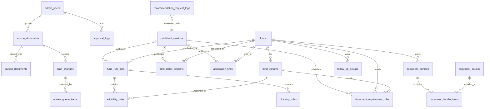

# 10. DB 스키마 초안

정책자금 추천 웹서비스의 운영 데이터를 PostgreSQL에 어떻게 저장할지 정리한 초안입니다.

이 문서는 바로 실행할 최종 마이그레이션 파일이 아니라, 개발자가 실제 테이블을 만들기 전에 `어떤 데이터를 어떤 관계로 저장할지` 합의하기 위한 기준 문서입니다.

## 문서 개요

| 항목 | 내용 |
| --- | --- |
| 기준일 | `2026-05-03` |
| 대상 DB | PostgreSQL |
| 주 독자 | 백엔드 개발자, 관리자 기능 개발자, PM |
| 연결 문서 | [04_기술_아키텍처.md](/Users/jeehun/Documents/GitHub/Government-backed funding/docs/04_기술_아키텍처.md), [06_추천규칙_데이터모델.md](/Users/jeehun/Documents/GitHub/Government-backed funding/docs/06_추천규칙_데이터모델.md), [07_서류안내_규칙정의.md](/Users/jeehun/Documents/GitHub/Government-backed funding/docs/07_서류안내_규칙정의.md), [09_추천_API_실제명세.md](/Users/jeehun/Documents/GitHub/Government-backed funding/docs/09_추천_API_실제명세.md) |

## 설계 방향

- 추천 서비스는 항상 `게시된 버전`의 규칙과 서류 데이터만 읽는다.
- 운영자가 수정 중인 초안과 사용자에게 적용되는 게시 데이터는 분리한다.
- 자금 마스터, 추천 규칙, 서류 규칙, 신청 링크는 서로 다른 도메인으로 관리한다.
- 조건식은 자주 바뀔 수 있으므로 `JSONB`를 일부 사용하되, 자금명, 코드, 상태, 버전처럼 자주 조회하는 값은 일반 컬럼으로 둔다.
- 개인정보와 민감 raw 값은 추천 로그에 저장하지 않는다.
- 신용점수는 정확한 점수가 아니라 `NICE 구간값`만 저장한다.
- 임대료, 보증금, 매출액은 원칙적으로 추천 계산에만 사용하고 로그에는 raw 값으로 남기지 않는다.
- 점수 컬럼은 자격요건 합산 점수가 아니라 `화면 노출 우선순위` 또는 `추천 강도`를 표현하는 용도로만 사용한다.

## 먼저 이해할 핵심 용어

### `rule_type`

`rule_type`은 이 규칙이 추천 엔진 안에서 어떤 역할을 하는지 구분하는 값이다. 쉽게 말하면 “이 조건을 만족했을 때 자금 카드를 보여줄지, 세부유형을 붙일지, 추가 확인으로 보낼지”를 정한다.

| 값 | 의미 | 화면/로직에서의 역할 | 예시 |
| --- | --- | --- | --- |
| `recommend` | 자금 자체를 추천하는 규칙 | 조건이 맞으면 추천 결과 카드에 해당 자금을 노출한다. | `온라인 판매 = 예`이면 `상생성장지원자금` 추천 |
| `variant_trigger` | 자금 안의 세부유형을 붙이는 규칙 | 이미 추천된 자금 안에서 `스마트기술유형`, `수출유형` 같은 세부유형을 표시한다. | `스마트기술 도입 = 예`이면 `혁신성장촉진자금(스마트기술유형)` |
| `review_needed` | 바로 추천/불가로 단정하기 어려운 규칙 | 추가 질문, 상담 검토, 증빙 확인이 필요하다는 상태를 만든다. | 매출감소 증빙이 필요하거나 특정 피해 사실 확인이 필요한 경우 |

중요한 점은 `variant_trigger`가 점수 합산 규칙이 아니라는 것이다. 예를 들어 `수출 여부`와 `로컬크리에이터 여부`가 모두 `예`이면 `수출유형`과 `로컬크리에이터유형`이 각각 매칭될 뿐, 두 값을 더해서 `스마트기술유형`이 추천되지는 않는다.

### `industry_level`

`industry_level`은 사용자가 선택한 업종 코드가 얼마나 큰 범위의 업종인지 나타낸다. 업종 데이터는 보통 대분류, 중분류, 세부업종처럼 계층 구조를 가지기 때문에 같은 `음식점업`이라도 큰 분류인지, 더 구체적인 업종인지 구분할 필요가 있다.

| 값 | 의미 | 사용하는 이유 |
| --- | --- | --- |
| `major` | 대분류 | 넓은 업종군을 보여주거나 상위 분류 기준의 제외업종을 판단할 때 사용 |
| `middle` | 중분류 | 사용자가 검색한 업종을 단계적으로 좁혀 보여줄 때 사용 |
| `small` | 세부업종 | 실제 추천 판정과 제외업종 판정의 기본 기준으로 사용 |
| `unknown` | 외부 API에서 상세도를 알 수 없음 | 외부 API 응답이 불완전할 때 임시 저장값으로 사용 |

MVP에서는 사용자가 최종 선택한 세부업종 코드만 있어도 추천은 가능하다. 다만 `industry_level`을 저장해두면 나중에 업종 검색 UI, 제외업종 관리, 업종별 예외 규칙을 운영자가 관리하기 쉬워진다.

## 스키마별 역할 요약

| 스키마 영역 | 핵심 질문 | 주요 테이블 |
| --- | --- | --- |
| 버전 / 게시 | 지금 추천 서비스가 어떤 운영 버전을 기준으로 계산하는가? | `published_versions` |
| 자금 마스터 | 어떤 정책자금과 세부유형이 존재하는가? | `funds`, `fund_variants`, `fund_detail_sections`, `application_links` |
| 추천 규칙 | 어떤 입력값이면 어떤 자금 또는 세부유형을 추천하는가? | `input_fields`, `fund_rule_sets`, `eligibility_rules`, `blocking_rules`, `follow_up_groups` |
| 서류 안내 | 추천된 자금과 기업 상태에 따라 어떤 서류를 보여주는가? | `document_catalog`, `document_bundles`, `document_bundle_items`, `document_requirement_rules`, `document_guides` |
| 업종 | 사용자가 선택한 업종과 제외업종 여부를 어떻게 관리하는가? | `industry_codes` |
| 문서 파싱 / 검토 / 승인 | 공고문 업로드 후 운영 데이터 반영 전까지 어떻게 검토하는가? | `source_documents`, `parsed_documents`, `draft_changes`, `review_queue_items`, `approval_logs` |
| 추천 요청 로그 | 추천 결과를 나중에 추적하되 어떤 값은 저장하지 않을 것인가? | `recommendation_request_logs` |
| 관리자 | 누가 운영 데이터를 수정, 검토, 게시할 수 있는가? | `admin_users`, `admin_sessions` |

## 전체 관계 흐름



## 1. 버전 / 게시 스키마

추천 결과는 운영 중인 하나의 규칙 버전을 기준으로 계산해야 한다. 이 기준점이 없으면 “어제는 추천됐는데 오늘은 왜 다르지?” 같은 문제를 추적하기 어렵다.

이 스키마는 추천 서비스가 참조하는 `운영 기준점`을 저장한다. 운영자가 규칙을 수정하더라도 바로 사용자에게 반영하지 않고, 검토와 게시 과정을 거쳐 특정 버전으로 고정해두기 위한 영역이다.

### `published_versions`

게시 가능한 운영 데이터의 버전을 저장한다. 추천 API는 이 테이블에서 현재 게시 중인 버전을 찾고, 그 버전에 연결된 추천 규칙과 서류 규칙만 사용한다.

| 컬럼 | 타입 | 설명 |
| --- | --- | --- |
| `id` | uuid | 내부 PK |
| `version_code` | text | 운영 버전. 예: `2026-05` |
| `status` | text | `draft`, `published`, `archived`, `rolled_back` |
| `published_at` | timestamptz | 게시 시각 |
| `published_by` | uuid | 게시한 관리자 |
| `source_document_id` | uuid, nullable | 기준이 된 원본 공고문 |
| `notes` | text, nullable | 게시 메모 |
| `created_at` | timestamptz | 생성 시각 |

운영 API는 기본적으로 `status = 'published'`이고 최신 `published_at`을 가진 버전만 조회한다.

## 2. 자금 마스터 스키마

자금 자체의 기본 정보와 세부유형을 저장한다. 추천 규칙은 이 테이블에 직접 섞지 않고 별도 규칙 테이블로 분리한다.

이 스키마는 “무슨 자금이 있는가”를 저장한다. 자금명, 세부유형, 결과 카드 설명, 신청 링크처럼 자금 자체의 설명 정보가 들어가며, 사용자의 입력 조건을 평가하는 규칙은 추천 규칙 스키마에서 관리한다.

### `funds`

정책자금의 기본 정보를 저장한다. 화면의 추천 카드에 표시되는 자금명, 요약 설명, 상세 페이지 주소의 기준이 된다.

| 컬럼 | 타입 | 설명 |
| --- | --- | --- |
| `id` | uuid | 내부 PK |
| `fund_code` | text | API와 규칙에서 사용하는 고정 코드. 예: `innovation_growth` |
| `fund_name` | text | 화면 표시명. 예: `혁신성장촉진자금` |
| `fund_type` | text | `direct_loan`, `guarantee`, `grant`, `other` |
| `summary` | text | 결과 카드에 쓰는 한 문단 요약 |
| `detail_page_slug` | text | 자금 상세 페이지 경로용 slug |
| `is_active` | boolean | 운영 노출 여부 |
| `sort_order` | integer | 기본 정렬 순서 |
| `created_at` | timestamptz | 생성 시각 |
| `updated_at` | timestamptz | 수정 시각 |

### `fund_variants`

한 자금 안에 있는 세부유형을 저장한다. 예를 들어 `혁신성장촉진자금` 안의 `스마트기술유형`, `수출유형`, `로컬크리에이터유형`이 여기에 해당한다.

| 컬럼 | 타입 | 설명 |
| --- | --- | --- |
| `id` | uuid | 내부 PK |
| `fund_id` | uuid | 상위 자금 |
| `variant_code` | text | 세부유형 코드. 예: `smart_tech`, `export` |
| `variant_name` | text | 세부유형명. 예: `스마트기술유형` |
| `description` | text | 세부유형 설명 |
| `display_priority` | integer | 같은 자금 안에서 세부유형 표시 우선순위 |
| `is_active` | boolean | 운영 사용 여부 |

### `fund_detail_sections`

자금명을 눌렀을 때 펼쳐지는 간단한 소개와 상세 페이지에서 사용할 설명 구간을 저장한다. `지원대상`, `특징`, `주의사항`처럼 구간별로 나누어 관리한다.

| 컬럼 | 타입 | 설명 |
| --- | --- | --- |
| `id` | uuid | 내부 PK |
| `fund_id` | uuid | 자금 |
| `version_id` | uuid | 게시 버전 |
| `section_type` | text | `target`, `features`, `support`, `notice` |
| `title` | text | 구간 제목 |
| `body` | text | 상세 설명 |
| `display_order` | integer | 표시 순서 |

결과 카드 토글에는 `summary`와 일부 `fund_detail_sections`만 보여주고, `[상세보기]`는 별도 자금 소개 페이지로 연결한다.

### `application_links`

자금별 공식 신청 페이지, 안내 페이지, 예약 페이지 링크를 저장한다. 링크는 자주 바뀔 수 있으므로 자금 설명과 분리해 관리한다.

| 컬럼 | 타입 | 설명 |
| --- | --- | --- |
| `id` | uuid | 내부 PK |
| `fund_id` | uuid | 자금 |
| `version_id` | uuid | 게시 버전 |
| `application_url` | text | 공식 신청 페이지 또는 안내 페이지 URL |
| `channel_type` | text | `official_site`, `reservation`, `notice`, `other` |
| `link_status` | text | `active`, `checking`, `inactive` |
| `checked_at` | timestamptz | 마지막 확인 시각 |
| `notes` | text | 운영 메모 |

## 3. 추천 규칙 스키마

[06_추천규칙_데이터모델.md](/Users/jeehun/Documents/GitHub/Government-backed funding/docs/06_추천규칙_데이터모델.md)의 내용을 DB에 저장하기 위한 영역이다.

이 스키마는 “사용자가 무엇을 선택하면 무엇을 추천할 것인가”를 저장한다. 자금 자체 추천, 세부유형 매칭, 추가 확인 필요, 신청 제한 조건을 모두 이 영역에서 관리한다.

### `input_fields`

추천 엔진이 받을 수 있는 입력값 목록을 저장한다. 화면의 라디오 버튼, 체크박스, 드롭다운이 백엔드에서는 어떤 필드명과 타입으로 들어오는지 고정하는 기준이다.

| 컬럼 | 타입 | 설명 |
| --- | --- | --- |
| `id` | uuid | 내부 PK |
| `field_id` | text | 입력 필드 ID. 예: `sells_online` |
| `label` | text | 관리자 화면 표시명 |
| `data_type` | text | `boolean`, `enum`, `number`, `object`, `array` |
| `required_policy` | text | `required`, `optional`, `conditional` |
| `enum_values` | jsonb | 선택값 목록 |
| `value_shape` | jsonb | object/array 구조 설명 |
| `ui_config` | jsonb | 라디오, 체크박스, 드롭다운 등 UI 힌트 |
| `is_active` | boolean | 사용 여부 |

### `fund_rule_sets`

자금별 추천 규칙 묶음을 저장한다. 같은 자금이라도 `2026-05` 버전과 `2026-06` 버전의 조건이 달라질 수 있으므로 버전과 함께 관리한다.

| 컬럼 | 타입 | 설명 |
| --- | --- | --- |
| `id` | uuid | 내부 PK |
| `fund_id` | uuid | 자금 |
| `version_id` | uuid | 게시 버전 |
| `eligibility_mode` | text | `direct_match`, `variant_trigger`, `review_only` |
| `display_priority` | integer | 여러 자금이 동시에 추천될 때의 화면 우선순위 |
| `rule_status` | text | `draft`, `published`, `archived` |
| `effective_from` | date | 적용 시작일 |
| `effective_to` | date, nullable | 적용 종료일 |
| `notes` | text | 운영 메모 |

`display_priority`는 “수출 30점 + 로컬크리에이터 20점 = 스마트기술 추천” 같은 합산 점수가 아니다. 동시에 여러 자금이 맞을 때 어떤 카드를 먼저 보여줄지 정하는 값이다.

### `eligibility_rules`

실제 추천 조건을 한 줄씩 저장한다. 예를 들어 `sells_online = true`이면 상생성장지원자금을 추천한다는 규칙, `smart_tech_adoption = true`이면 스마트기술유형을 붙인다는 규칙이 여기에 들어간다.

| 컬럼 | 타입 | 설명 |
| --- | --- | --- |
| `id` | uuid | 내부 PK |
| `rule_set_id` | uuid | 자금별 규칙 묶음 |
| `rule_id` | text | 규칙 코드 |
| `rule_type` | text | `recommend`, `variant_trigger`, `review_needed` |
| `field_id` | text | 평가할 입력 필드 |
| `operator` | text | `equals`, `in`, `lte`, `gte`, `exists`, `any_true` |
| `expected_value` | jsonb | 비교 기준값 |
| `result_status` | text | `recommended`, `review_needed`, `not_recommended` |
| `variant_id` | uuid, nullable | 세부유형 규칙이면 연결 |
| `message` | text | 사용자에게 보여줄 추천 이유 |
| `guidance_message` | text, nullable | 추천 이유와 별도로 보여줄 안내문 |
| `display_priority` | integer | 같은 자금 안에서 근거 표시 순서 |
| `condition_group` | jsonb | 복합 조건이 필요할 때 사용 |

예를 들어 상생성장지원자금은 `sells_online = true`만으로 추천하되 `TOPS/POST-TOPS 참여 필요` 안내문을 별도 `guidance_message`로 둔다.

### `blocking_rules`

추천 계산보다 먼저 확인해야 하는 차단 조건을 저장한다. 체납, 제외업종, 권리침해처럼 특정 조건에서는 추천 결과를 보여주기 전에 신청 제한 안내가 필요하다.

| 컬럼 | 타입 | 설명 |
| --- | --- | --- |
| `id` | uuid | 내부 PK |
| `version_id` | uuid | 게시 버전 |
| `fund_id` | uuid, nullable | 특정 자금 전용이면 값 존재 |
| `rule_id` | text | 탈락 또는 차단 규칙 코드 |
| `field_id` | text | 평가 필드 |
| `operator` | text | 비교 방식 |
| `expected_value` | jsonb | 차단 조건값 |
| `block_level` | text | `global`, `fund`, `warning` |
| `message` | text | 사용자 안내문 |
| `is_active` | boolean | 사용 여부 |

체납, 제외업종, 권리침해처럼 추천보다 먼저 봐야 하는 조건을 저장한다.

### `follow_up_groups`

1차 입력만으로 세부유형이나 서류를 정확히 확정하기 어려울 때 보여줄 추가 질문 묶음을 저장한다. 공동대표 추가 입력, 혁신성장 세부유형 확인, TOPS 참여 증빙 확인 같은 후속 질문을 이 영역으로 관리한다.

| 컬럼 | 타입 | 설명 |
| --- | --- | --- |
| `id` | uuid | 내부 PK |
| `follow_up_group_id` | text | 후속 질문 그룹 코드 |
| `fund_id` | uuid | 연결 자금 |
| `show_when` | jsonb | 그룹 노출 조건 |
| `resolution_mode` | text | `variant_refinement`, `document_refinement`, `guidance_only` |
| `fields` | jsonb | 후속 질문 필드 목록 |
| `is_active` | boolean | 사용 여부 |

공동대표가 `여`일 때 공동대표별 거주/임대 여부 입력 칸을 늘리는 동작도 별도 UI 로직이지만, 어떤 후속 질문이 필요한지는 이 테이블 기준으로 관리할 수 있다.

## 4. 서류 안내 스키마

[07_서류안내_규칙정의.md](/Users/jeehun/Documents/GitHub/Government-backed funding/docs/07_서류안내_규칙정의.md)의 `문서명 / 발급처 / 발급방법 / 제출 시점 / 적용 조건`을 저장한다.

이 스키마는 “추천된 자금과 기업 상태를 조합했을 때 어떤 서류를 보여줄 것인가”를 저장한다. 개별 서류 사전, 서류 묶음, 조건별 서류 조합 규칙을 분리해서 관리한다.

### `document_catalog`

개별 서류의 기본 정보를 저장하는 사전이다. `사업장 임대차계약서`, `법인 등기사항 전부증명서`, `통신판매업신고증 사본`처럼 사용자에게 보이는 문서명과 발급처, 발급방법이 여기에 들어간다.

| 컬럼 | 타입 | 설명 |
| --- | --- | --- |
| `id` | uuid | 내부 PK |
| `doc_code` | text | 서류 코드. 예: `business_lease_contract` |
| `doc_name` | text | 문서명 |
| `issuer` | text | 발급처 또는 보유 주체 |
| `issuance_method` | text | 발급방법 |
| `default_submission_timing` | text | `application_form`, `consent`, `auto_check`, `recommended_before_review`, `after_review` |
| `is_auto_check_available` | boolean | 공공마이데이터 또는 행정정보 공동이용 가능 여부 |
| `notes` | text | 안내 문구 |
| `is_active` | boolean | 사용 여부 |

`대표자 확인`, `사업자 확인`, `세금 확인`처럼 공공마이데이터 또는 동의로 확인되는 항목은 `is_auto_check_available = true`로 두고, 사용자가 직접 업로드할 서류처럼 표현하지 않는다.

### `document_bundles`

여러 서류를 하나의 묶음으로 관리한다. 예를 들어 `BASE-03 사업장 권리세트-임차`는 사업장 임대차계약서와 등기부등본을 함께 안내하기 위한 묶음이다.

| 컬럼 | 타입 | 설명 |
| --- | --- | --- |
| `id` | uuid | 내부 PK |
| `bundle_code` | text | 묶음 코드. 예: `BASE-03`, `VAR-IG-01` |
| `bundle_name` | text | 묶음명 |
| `bundle_scope` | text | `base`, `fund`, `variant`, `review` |
| `fund_id` | uuid, nullable | 특정 자금용 묶음이면 연결 |
| `variant_id` | uuid, nullable | 특정 세부유형용 묶음이면 연결 |
| `default_submission_timing` | text | 기본 제출 시점 |
| `notes` | text | 운영 메모 |
| `is_active` | boolean | 사용 여부 |

### `document_bundle_items`

서류 묶음 안에 어떤 개별 서류가 들어가는지 저장한다. 하나의 서류가 여러 묶음에 재사용될 수 있으므로 별도 연결 테이블로 둔다.

| 컬럼 | 타입 | 설명 |
| --- | --- | --- |
| `id` | uuid | 내부 PK |
| `bundle_id` | uuid | 서류 묶음 |
| `document_id` | uuid | 개별 서류 |
| `display_order` | integer | 묶음 안 표시 순서 |
| `condition_note` | text | 조건 문구. 예: `사업장 임차 또는 전대인 경우` |
| `notes` | text | 보충 안내 |

### `document_requirement_rules`

사용자 조건과 추천 자금에 따라 어떤 서류 묶음을 붙일지 저장한다. 예를 들어 사업장이 임차이면 `BASE-03`, 법인이면 `BASE-06`, 혁신성장 스마트기술유형이면 `VAR-IG-01`을 붙인다.

| 컬럼 | 타입 | 설명 |
| --- | --- | --- |
| `id` | uuid | 내부 PK |
| `version_id` | uuid | 게시 버전 |
| `applies_to_type` | text | `common`, `fund`, `variant`, `business_site`, `residence`, `joint_representative` |
| `fund_id` | uuid, nullable | 자금 조건이면 연결 |
| `variant_id` | uuid, nullable | 세부유형 조건이면 연결 |
| `when_conditions` | jsonb | 사용자 입력 조건 |
| `required_bundle_codes` | text[] | 신청 전 기본 제출 권장 묶음 |
| `review_bundle_codes` | text[] | 심사 후 또는 필요 시 제출 묶음 |
| `blocking_hint` | text, nullable | 신청 제한 안내 |
| `display_order` | integer | 출력 순서 |
| `is_active` | boolean | 사용 여부 |

`기본서류 + 자금별 추가서류 + 세부유형 추가서류 + 심사 후 보강서류` 조합은 이 테이블과 `document_bundles`를 함께 조회해서 만든다.

### `document_guides`

서류별 상세 발급 안내를 저장한다. 짧은 발급처/발급방법은 `document_catalog`에 두고, 길이가 긴 안내나 외부 링크는 이 테이블에서 관리한다.

| 컬럼 | 타입 | 설명 |
| --- | --- | --- |
| `id` | uuid | 내부 PK |
| `document_id` | uuid | 개별 서류 |
| `version_id` | uuid | 게시 버전 |
| `guide_title` | text | 안내 제목 |
| `guide_body` | text | 발급/준비 안내 본문 |
| `external_url` | text, nullable | 정부24, 인터넷등기소 등 링크 |
| `updated_by` | uuid | 수정한 관리자 |
| `updated_at` | timestamptz | 수정 시각 |

서류 발급방법이 길어지면 `document_catalog`의 짧은 설명과 `document_guides`의 상세 설명을 분리한다.

## 5. 업종 스키마

업종은 화면에서 외부 API로 검색하되, 추천 계산과 제외업종 판정은 선택된 업종 코드를 기준으로 한다.

이 스키마는 업종 검색 결과와 제외업종 판정 기준을 저장한다. 외부 API를 매번 호출하더라도 사용자가 최종 선택한 업종 코드는 내부에 남겨야 추천 결과와 로그를 안정적으로 추적할 수 있다.

### `industry_codes`

업종 코드, 업종명, 업종 상세도, 제외업종 여부를 저장한다. `industry_level`은 이 코드가 대분류인지 세부업종인지 구분하기 위한 값이다.

| 컬럼 | 타입 | 설명 |
| --- | --- | --- |
| `industry_code` | text | 업종 코드 PK |
| `industry_name` | text | 업종명 |
| `industry_level` | text | `major`, `middle`, `small`, `unknown` |
| `parent_code` | text, nullable | 상위 업종 코드 |
| `standard_industry_name` | text | 표준 업종명 |
| `is_excluded` | boolean | 제외업종 여부 |
| `source` | text | `external_api`, `manual`, `import` |
| `synced_at` | timestamptz | 마지막 동기화 시각 |

MVP에서는 외부 API 결과를 매번 조회하되, 사용자가 선택한 코드는 캐시 또는 스냅샷으로 저장해 같은 업종명 표시가 흔들리지 않게 한다.

## 6. 문서 파싱 / 검토 / 승인 스키마

관리자가 정책자금 안내자료를 업로드하면, 시스템은 원본 파일과 파싱 결과를 저장하고 AI 초안을 검토 대기열로 보낸다.

이 스키마는 공고문이나 신청안내자료를 운영 데이터로 바꾸는 과정을 저장한다. 원본 문서, 파싱 결과, AI가 만든 변경 초안, 관리자 검토 상태, 승인 이력을 분리해 운영 안정성을 확보한다.

### `source_documents`

관리자가 업로드한 원본 파일의 메타데이터를 저장한다. 실제 파일은 S3에 두고, DB에는 파일명, 저장 경로, 업로드자, 파싱 상태를 남긴다.

| 컬럼 | 타입 | 설명 |
| --- | --- | --- |
| `id` | uuid | 내부 PK |
| `original_file_name` | text | 업로드 원본 파일명 |
| `s3_object_key` | text | S3 원본 저장 경로 |
| `document_type` | text | `notice`, `application_guide`, `form`, `other` |
| `fund_id` | uuid, nullable | 특정 자금 안내자료면 연결 |
| `uploaded_by` | uuid | 업로드 관리자 |
| `uploaded_at` | timestamptz | 업로드 시각 |
| `checksum` | text | 중복 파일 감지용 해시 |
| `parse_status` | text | `pending`, `parsed`, `failed`, `manual_review` |

### `parsed_documents`

원본 문서를 텍스트나 구조화 JSON으로 변환한 결과를 저장한다. 파싱이 실패하거나 일부만 성공한 경우도 상태와 오류 메시지를 남겨 재처리할 수 있게 한다.

| 컬럼 | 타입 | 설명 |
| --- | --- | --- |
| `id` | uuid | 내부 PK |
| `source_document_id` | uuid | 원본 문서 |
| `parsed_s3_key` | text | 파싱 결과 저장 경로 |
| `parser_type` | text | `pdf_text`, `ocr`, `llm_extract`, `manual` |
| `normalized_text_hash` | text | 정규화 텍스트 해시 |
| `extracted_json` | jsonb | 구조화 추출 결과 |
| `parse_status` | text | `success`, `partial`, `failed` |
| `error_message` | text, nullable | 실패 사유 |
| `created_at` | timestamptz | 생성 시각 |

### `draft_changes`

문서 파싱이나 운영자 수동 입력으로 만들어진 변경 초안을 저장한다. 추천 규칙, 서류 규칙, 신청 링크, 자금 설명 변경은 곧바로 게시하지 않고 이 테이블에서 검토 대상으로 관리한다.

| 컬럼 | 타입 | 설명 |
| --- | --- | --- |
| `id` | uuid | 내부 PK |
| `source_document_id` | uuid, nullable | 문서 기반 초안이면 연결 |
| `target_domain` | text | `fund_rule`, `document_rule`, `document_guide`, `application_link`, `fund_detail` |
| `change_type` | text | `create`, `update`, `deactivate` |
| `before_snapshot` | jsonb | 변경 전 값 |
| `after_snapshot` | jsonb | 변경 후 값 |
| `diff_summary` | text | 변경 요약 |
| `confidence_score` | numeric | AI 추출 신뢰도 |
| `status` | text | `draft`, `in_review`, `approved`, `rejected`, `published` |
| `created_by` | uuid, nullable | 수동 생성 관리자 또는 시스템 |
| `created_at` | timestamptz | 생성 시각 |

### `review_queue_items`

검토해야 할 변경 초안의 담당자와 상태를 저장한다. 운영자가 어떤 초안을 보고 승인하거나 반려해야 하는지 관리하는 대기열 역할을 한다.

| 컬럼 | 타입 | 설명 |
| --- | --- | --- |
| `id` | uuid | 내부 PK |
| `draft_change_id` | uuid | 검토 대상 초안 |
| `assigned_to` | uuid, nullable | 담당 관리자 |
| `review_status` | text | `waiting`, `reviewing`, `approved`, `rejected` |
| `reviewer_comment` | text, nullable | 검토 의견 |
| `due_at` | timestamptz, nullable | 검토 희망 기한 |
| `created_at` | timestamptz | 생성 시각 |

### `approval_logs`

승인, 반려, 게시, 롤백 같은 운영 행위의 이력을 저장한다. 나중에 “누가 언제 무엇을 왜 바꿨는지” 추적하기 위한 감사 로그다.

| 컬럼 | 타입 | 설명 |
| --- | --- | --- |
| `id` | uuid | 내부 PK |
| `target_domain` | text | 변경된 도메인 |
| `target_id` | uuid | 변경 대상 ID |
| `action` | text | `approve`, `reject`, `publish`, `rollback`, `manual_update` |
| `before_snapshot` | jsonb | 변경 전 값 |
| `after_snapshot` | jsonb | 변경 후 값 |
| `actor_id` | uuid | 처리 관리자 |
| `acted_at` | timestamptz | 처리 시각 |
| `reason` | text | 처리 사유 |

## 7. 추천 요청 로그 스키마

추천 품질 개선과 장애 추적을 위해 최소 로그만 저장한다. 입력 원문을 모두 저장하지 않는 것이 원칙이다.

이 스키마는 추천 API가 어떤 버전의 규칙으로 어떤 결과를 냈는지 최소한으로 남긴다. 개인정보나 민감한 금액 raw 값은 저장하지 않고, 구간값과 결과 코드 중심으로만 기록한다.

### `recommendation_request_logs`

사용자 추천 요청의 저위험 추적 정보를 저장한다. 추천 품질 분석, 장애 원인 확인, 버전별 결과 비교에 쓰되 사용자 식별 목적의 값은 저장하지 않는다.

| 컬럼 | 타입 | 설명 |
| --- | --- | --- |
| `id` | uuid | 내부 PK |
| `request_id` | text | API 요청 추적 ID |
| `version_id` | uuid | 사용한 게시 버전 |
| `api_version` | text | API 버전 |
| `matched_fund_codes` | text[] | 추천된 자금 코드 목록 |
| `matched_variant_codes` | text[] | 매칭된 세부유형 코드 목록 |
| `credit_score_band_nice` | text | NICE 점수 구간 |
| `industry_code` | text | 선택 업종 코드 |
| `industry_is_excluded` | boolean | 제외업종 여부 |
| `employee_band` | text | 상시근로자 구간 |
| `has_blocking_condition` | boolean | 공통 차단 조건 존재 여부 |
| `created_at` | timestamptz | 생성 시각 |

저장하지 않는 값은 아래와 같다.

| 저장하지 않는 값 | 이유 |
| --- | --- |
| 대표자 이름 | 추천 계산에 불필요 |
| 사업자등록번호 | 개인정보·식별정보 리스크 |
| 연락처, 이메일 | 비로그인 추천에는 불필요 |
| 정확한 신용점수 | 구간값으로 충분 |
| 정확한 보증금, 월임대료 | 서류 분기에는 점유 형태만 우선 사용 |
| 정확한 매출액 | 매출 구간값으로 충분 |

## 8. 관리자 스키마

이 스키마는 운영자, 검토자, 관리자 계정과 세션을 관리한다. 추천 규칙이나 서류 안내는 운영 데이터이므로 누가 수정하고 승인했는지 추적할 수 있어야 한다.

### `admin_users`

관리자 계정과 역할을 저장한다. 운영 담당자, 검토 담당자, 시스템 관리자의 권한을 구분하는 기준이 된다.

| 컬럼 | 타입 | 설명 |
| --- | --- | --- |
| `id` | uuid | 내부 PK |
| `email` | citext | 로그인 이메일 |
| `name` | text | 관리자명 |
| `role` | text | `operator`, `reviewer`, `admin` |
| `status` | text | `active`, `inactive`, `locked` |
| `password_hash` | text, nullable | 자체 로그인 사용 시 |
| `external_auth_id` | text, nullable | 외부 인증 사용 시 |
| `created_at` | timestamptz | 생성 시각 |
| `last_login_at` | timestamptz, nullable | 마지막 로그인 |

### `admin_sessions`

관리자 로그인 세션을 저장한다. 실제 세션 토큰 원문은 저장하지 않고 해시값만 저장하는 것을 원칙으로 한다.

| 컬럼 | 타입 | 설명 |
| --- | --- | --- |
| `id` | uuid | 내부 PK |
| `admin_user_id` | uuid | 관리자 |
| `session_token_hash` | text | 세션 토큰 해시 |
| `expires_at` | timestamptz | 만료 시각 |
| `created_at` | timestamptz | 생성 시각 |
| `revoked_at` | timestamptz, nullable | 폐기 시각 |

MVP에서 외부 인증을 쓰면 `password_hash`는 비워두고 `external_auth_id`를 사용한다.

## 핵심 DDL 초안

아래 DDL은 구조 검토용 예시다. 실제 구현 시에는 Alembic 등 마이그레이션 도구 기준으로 분리한다.

```sql
create extension if not exists pgcrypto;
create extension if not exists citext;

create table admin_users (
    id uuid primary key default gen_random_uuid(),
    email citext not null unique,
    name text not null,
    role text not null check (role in ('operator', 'reviewer', 'admin')),
    status text not null default 'active' check (status in ('active', 'inactive', 'locked')),
    password_hash text,
    external_auth_id text,
    created_at timestamptz not null default now(),
    last_login_at timestamptz
);

create table published_versions (
    id uuid primary key default gen_random_uuid(),
    version_code text not null unique,
    status text not null check (status in ('draft', 'published', 'archived', 'rolled_back')),
    published_at timestamptz,
    published_by uuid references admin_users(id),
    source_document_id uuid,
    notes text,
    created_at timestamptz not null default now()
);

create table funds (
    id uuid primary key default gen_random_uuid(),
    fund_code text not null unique,
    fund_name text not null,
    fund_type text not null default 'direct_loan',
    summary text not null,
    detail_page_slug text not null unique,
    is_active boolean not null default true,
    sort_order integer not null default 100,
    created_at timestamptz not null default now(),
    updated_at timestamptz not null default now()
);

create table fund_variants (
    id uuid primary key default gen_random_uuid(),
    fund_id uuid not null references funds(id),
    variant_code text not null,
    variant_name text not null,
    description text,
    display_priority integer not null default 100,
    is_active boolean not null default true,
    unique (fund_id, variant_code)
);

create table fund_rule_sets (
    id uuid primary key default gen_random_uuid(),
    fund_id uuid not null references funds(id),
    version_id uuid not null references published_versions(id),
    eligibility_mode text not null check (eligibility_mode in ('direct_match', 'variant_trigger', 'review_only')),
    display_priority integer not null default 100,
    rule_status text not null check (rule_status in ('draft', 'published', 'archived')),
    effective_from date not null,
    effective_to date,
    notes text,
    unique (fund_id, version_id)
);

create table eligibility_rules (
    id uuid primary key default gen_random_uuid(),
    rule_set_id uuid not null references fund_rule_sets(id),
    rule_id text not null,
    rule_type text not null check (rule_type in ('recommend', 'variant_trigger', 'review_needed')),
    field_id text not null,
    operator text not null,
    expected_value jsonb not null,
    result_status text not null check (result_status in ('recommended', 'review_needed', 'not_recommended')),
    variant_id uuid references fund_variants(id),
    message text not null,
    guidance_message text,
    display_priority integer not null default 100,
    condition_group jsonb not null default '{}'::jsonb,
    unique (rule_set_id, rule_id)
);

create table document_catalog (
    id uuid primary key default gen_random_uuid(),
    doc_code text not null unique,
    doc_name text not null,
    issuer text not null,
    issuance_method text not null,
    default_submission_timing text not null,
    is_auto_check_available boolean not null default false,
    notes text,
    is_active boolean not null default true
);

create table document_bundles (
    id uuid primary key default gen_random_uuid(),
    bundle_code text not null unique,
    bundle_name text not null,
    bundle_scope text not null check (bundle_scope in ('base', 'fund', 'variant', 'review')),
    fund_id uuid references funds(id),
    variant_id uuid references fund_variants(id),
    default_submission_timing text not null,
    notes text,
    is_active boolean not null default true
);

create table document_bundle_items (
    id uuid primary key default gen_random_uuid(),
    bundle_id uuid not null references document_bundles(id),
    document_id uuid not null references document_catalog(id),
    display_order integer not null default 100,
    condition_note text,
    notes text,
    unique (bundle_id, document_id)
);

create table document_requirement_rules (
    id uuid primary key default gen_random_uuid(),
    version_id uuid not null references published_versions(id),
    applies_to_type text not null,
    fund_id uuid references funds(id),
    variant_id uuid references fund_variants(id),
    when_conditions jsonb not null default '{}'::jsonb,
    required_bundle_codes text[] not null default '{}',
    review_bundle_codes text[] not null default '{}',
    blocking_hint text,
    display_order integer not null default 100,
    is_active boolean not null default true
);

create table industry_codes (
    industry_code text primary key,
    industry_name text not null,
    industry_level text not null check (industry_level in ('major', 'middle', 'small', 'unknown')),
    parent_code text,
    standard_industry_name text not null,
    is_excluded boolean not null default false,
    source text not null,
    synced_at timestamptz not null default now()
);

create table recommendation_request_logs (
    id uuid primary key default gen_random_uuid(),
    request_id text not null,
    version_id uuid not null references published_versions(id),
    api_version text not null,
    matched_fund_codes text[] not null default '{}',
    matched_variant_codes text[] not null default '{}',
    credit_score_band_nice text,
    industry_code text references industry_codes(industry_code),
    industry_is_excluded boolean,
    employee_band text,
    has_blocking_condition boolean not null default false,
    created_at timestamptz not null default now()
);
```

## JSONB 저장 예시

### 상생성장지원자금 온라인 판매 추천 규칙

```json
{
  "rule_id": "winwin-online-sales-recommend",
  "rule_type": "recommend",
  "field_id": "growth_signals.sells_online",
  "operator": "equals",
  "expected_value": true,
  "result_status": "recommended",
  "message": "온라인 판매가 확인되어 상생성장지원자금 추천 대상입니다.",
  "guidance_message": "상생성장지원자금 신청 시 TOPS/POST-TOPS 참여가 필요합니다.",
  "display_priority": 60
}
```

### 혁신성장촉진자금 스마트기술 세부유형 규칙

```json
{
  "rule_id": "innovation-smart-tech",
  "rule_type": "variant_trigger",
  "field_id": "innovation_signals.smart_tech_adoption",
  "operator": "equals",
  "expected_value": true,
  "result_status": "recommended",
  "variant_code": "smart_tech",
  "message": "스마트기술 도입이 확인되어 혁신성장촉진자금 스마트기술유형에 해당할 수 있습니다.",
  "display_priority": 90
}
```

### 사업장 임차 서류 규칙

```json
{
  "applies_to_type": "business_site",
  "when_conditions": {
    "business_site.occupancy_type": {
      "operator": "in",
      "value": ["leased", "subleased"]
    }
  },
  "required_bundle_codes": ["BASE-03"],
  "review_bundle_codes": ["BASE-08"],
  "blocking_hint": "사업장 권리침해가 있는 경우 신청이 제한될 수 있습니다."
}
```

## API 응답과 DB 매핑

| API 응답 영역 | 주 사용 테이블 | 설명 |
| --- | --- | --- |
| 추천 자금명 | `funds` | `fund_code`, `fund_name` |
| 간략 추천 이유 | `eligibility_rules` | 매칭된 규칙의 `message` |
| 별도 안내문 | `eligibility_rules.guidance_message` | TOPS 참여 필요, 교육 이수 필요 같은 안내 |
| 세부유형 | `fund_variants`, `eligibility_rules` | 매칭된 `variant_id` 기준 |
| 자금 카드 토글 요약 | `funds`, `fund_detail_sections` | 한 문단 설명, 지원대상, 특징 |
| 상세보기 링크 | `funds.detail_page_slug`, `application_links` | 내부 상세 페이지와 공식 신청 링크 |
| 맞춤 제출서류 | `document_requirement_rules`, `document_bundles`, `document_catalog`, `document_guides` | 사용자 조건에 맞는 서류 조합 |
| 심사 후 추가서류 | `document_requirement_rules.review_bundle_codes` | 신청 시 같이 준비하면 좋다는 문구와 함께 출력 |

## 권장 인덱스

```sql
create unique index idx_funds_code on funds (fund_code);
create index idx_funds_active_sort on funds (is_active, sort_order);
create unique index idx_fund_variants_code on fund_variants (fund_id, variant_code);
create index idx_published_versions_status on published_versions (status, published_at desc);
create index idx_fund_rule_sets_version on fund_rule_sets (version_id, fund_id);
create index idx_eligibility_rules_rule_set on eligibility_rules (rule_set_id, display_priority);
create index idx_document_requirement_rules_version on document_requirement_rules (version_id, applies_to_type, display_order);
create index idx_document_requirement_rules_conditions_gin on document_requirement_rules using gin (when_conditions);
create index idx_recommendation_logs_created_at on recommendation_request_logs (created_at desc);
create index idx_industry_codes_name on industry_codes (industry_name);
```

업종명 검색 품질이 중요해지면 PostgreSQL `pg_trgm` 확장 또는 외부 업종 검색 API 캐시 전략을 추가 검토한다.

## MVP 우선순위

### 1차 구현 필수

| 영역 | 테이블 |
| --- | --- |
| 관리자/버전 | `admin_users`, `published_versions` |
| 자금 정보 | `funds`, `fund_variants`, `fund_detail_sections`, `application_links` |
| 추천 규칙 | `input_fields`, `fund_rule_sets`, `eligibility_rules`, `blocking_rules`, `follow_up_groups` |
| 서류 안내 | `document_catalog`, `document_bundles`, `document_bundle_items`, `document_requirement_rules`, `document_guides` |
| 업종 | `industry_codes` |
| 로그 | `recommendation_request_logs` |

### 2차로 미뤄도 되는 영역

| 영역 | 테이블 |
| --- | --- |
| AI 문서 파싱 자동화 | `source_documents`, `parsed_documents` |
| AI 변경 초안 | `draft_changes` |
| 검토 대기열 | `review_queue_items` |
| 상세 감사 로그 고도화 | `approval_logs` |

단, 관리자 콘솔에서 문서 업로드와 AI 추출까지 MVP에 포함한다면 `source_documents`, `parsed_documents`, `draft_changes`, `review_queue_items`, `approval_logs`도 1차 범위로 올려야 한다.

## 구현 순서 권장

1. `funds`, `fund_variants`, `published_versions`를 먼저 만든다.
2. `input_fields`, `fund_rule_sets`, `eligibility_rules`, `blocking_rules`로 추천 결과를 계산한다.
3. `document_catalog`, `document_bundles`, `document_requirement_rules`로 맞춤 제출서류를 조합한다.
4. `fund_detail_sections`, `application_links`를 붙여 결과 카드와 상세보기 이동을 완성한다.
5. `recommendation_request_logs`를 붙이되 개인정보 raw 값 저장을 막는다.
6. 관리자 검토 기능이 필요해지는 시점에 `source_documents`, `draft_changes`, `review_queue_items`, `approval_logs`를 추가한다.

## 남은 결정사항

| 결정사항 | 기본 제안 |
| --- | --- |
| enum을 DB enum으로 만들지 text check로 둘지 | MVP는 `text + check`로 시작하고, 값이 안정되면 enum 검토 |
| 규칙 DSL을 어디까지 DB화할지 | 1차는 `field_id/operator/expected_value + condition_group` 조합으로 충분 |
| 추천 로그 보관 기간 | MVP는 90일 보관 후 집계값만 남기는 방식 권장 |
| 문서 파싱 자동화를 MVP에 넣을지 | 추천 API 구현을 먼저 끝낸 뒤 관리자 자동화 범위를 재확정 |
| 신청 링크 검증 주기 | 월 1회 또는 공고문 업로드 시 수동 확인부터 시작 |
