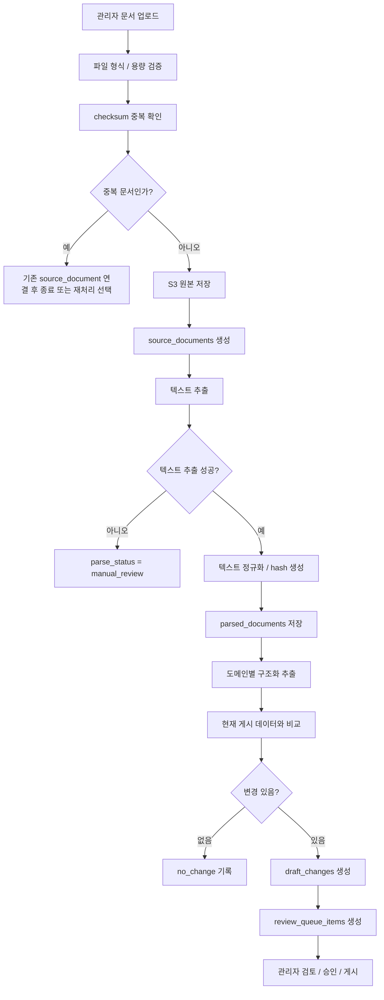

# 12. 문서파싱 변경감지 전략

> 적용 상태 (`2026-09-18`): AI + Playwright MCP로 수집 코드를 구축·유지보수하고, 정상 수집은 검증된 코드가 HTML/본문/PDF/HWP 원본만 S3 RAW에 저장한다. 수집 단계의 본문·첨부 해시 변경 감지와, 두 번째 Agent의 파싱·정형화 후 업무 조건 변경 비교는 서로 다른 작업이다. 현재 수집 경계·불변 버전·부분 실패·재처리 기준은 [16_RAW_수집_가공_분리_설계.md](16_RAW_수집_가공_분리_설계.md)를 우선한다. 아래 업로드·파싱·검토 모델은 후속 가공 참고이며, 정책자금 스키마나 PDF/HWP 파싱 성공을 RAW 수집의 선행조건으로 적용하지 않는다. 주간 Airflow는 수집 실증 후 연결하고 대화형 안내는 [15_대화형_정책자금_안내_전환계획.md](15_대화형_정책자금_안내_전환계획.md)를 따른다.

정책자금 신청안내자료, 공고문, 서식 파일을 업로드했을 때 시스템이 문서를 어떻게 파싱하고, 기존 운영 데이터와 무엇이 달라졌는지 감지한 뒤, 관리자 검토 초안으로 넘길지 정의한 문서입니다.

이 문서는 “문서를 올리면 자동으로 운영 데이터가 바뀐다”는 자동화 명세가 아닙니다. 원본 문서에서 근거를 찾고, 변경 후보를 만들고, 관리자가 검토한 뒤에만 게시되도록 하는 안전한 문서 처리 전략입니다.

## 문서 개요

| 항목 | 내용 |
| --- | --- |
| 기준일 | `2026-05-10` |
| 주 독자 | 백엔드 개발자, 관리자 기능 개발자, 운영 담당자 |
| 연결 문서 | [03_시스템_아키텍처.md](/Users/jeehun/Documents/GitHub/Government-backed funding/docs/03_시스템_아키텍처.md), [04_기술_아키텍처.md](/Users/jeehun/Documents/GitHub/Government-backed funding/docs/04_기술_아키텍처.md), [10_DB_스키마_초안.md](/Users/jeehun/Documents/GitHub/Government-backed funding/docs/10_DB_스키마_초안.md), [11_관리자_검토모델.md](/Users/jeehun/Documents/GitHub/Government-backed funding/docs/11_관리자_검토모델.md) |

## 1. 전략의 목적

문서파싱 변경감지 전략의 목적은 최신 안내자료를 운영자가 안전하게 반영할 수 있도록 돕는 것이다.

- 원본 문서, 파싱 결과, 변경 초안을 서로 분리해 저장한다.
- 같은 문서를 반복 업로드했을 때 중복 처리를 막는다.
- 문서에서 추출한 내용과 현재 게시 데이터를 비교해 변경 후보만 만든다.
- 추천 규칙, 서류 안내, 자금 소개/신청방법 안내 링크, 자금 설명이 바뀌었을 때 관리자 검토 대기열로 넘긴다.
- 파싱 실패나 신뢰도 낮은 결과가 사용자 추천 결과에 영향을 주지 않게 한다.
- 모든 변경 후보에는 원문 근거, 변경 전/후 값, 신뢰도를 함께 남긴다.

## 2. 핵심 원칙

| 원칙 | 설명 |
| --- | --- |
| 자동 게시 금지 | 파싱 결과는 운영 데이터에 바로 반영하지 않고 `draft_changes`로만 생성한다. |
| 원문 근거 필수 | 변경 초안은 원본 파일명, 페이지, 구간명, 발췌문을 함께 가져야 한다. |
| 게시 데이터 보호 | 파싱 실패, LLM 오류, OCR 실패가 있어도 현재 게시 버전은 그대로 유지한다. |
| 낮은 신뢰도 분리 | 신뢰도가 낮거나 근거 위치가 불명확하면 자동 초안을 만들지 않고 수동 검토로 보낸다. |
| 도메인별 비교 | 추천 규칙, 서류 규칙, 서류 가이드, 자금 안내 링크, 자금 설명을 분리해 비교한다. |
| 재처리 가능 | 같은 원본 문서를 다른 파서 버전으로 다시 처리할 수 있어야 한다. |

## 3. 적용 범위

### MVP 1차 필수

| 범위 | 설명 |
| --- | --- |
| 파일 업로드 | 관리자 화면에서 PDF, 이미지 PDF, 문서 파일을 업로드한다. |
| 원본 보관 | 원본 파일은 S3에 저장하고 `source_documents`에 메타데이터를 남긴다. |
| 중복 감지 | 파일 checksum으로 동일 문서 재업로드를 감지한다. |
| 업로드 화면 구분 | `자금 안내 업로드`와 `서류 안내 업로드`를 분리한다. |
| 메타데이터 입력/추출 | AI가 문서에서 메타데이터를 추출하되, 운영자가 직접 입력하거나 수정할 수 있게 한다. |
| 텍스트 추출 | 텍스트 기반 PDF는 우선 일반 텍스트 파서로 추출한다. |
| 파싱 상태 저장 | 파싱 성공, 실패, 수동검토 필요 상태를 `parsed_documents`에 저장한다. |
| 도메인 분류 | 추출 내용이 추천 규칙, 서류 안내, 자금 안내 링크, 자금 설명 중 어디에 해당하는지 분류한다. |
| 변경 감지 | 현재 게시 데이터와 비교해 생성, 수정, 비활성화 후보를 만든다. |
| 검토 초안 생성 | 변경이 있으면 `draft_changes`와 `review_queue_items`를 생성한다. |

### 2차로 미뤄도 되는 범위

| 범위 | 미뤄도 되는 이유 |
| --- | --- |
| 고정밀 OCR | 스캔 PDF 대응은 중요하지만 MVP에서는 수동 검토로 우회 가능하다. |
| 복잡한 표 추출 | 자금별 한도, 금리, 기간 표는 초기에는 자금 상세 설명으로 수동 관리 가능하다. |
| LLM 자동 구조화 고도화 | 추천 API와 관리자 검토 흐름이 안정된 뒤 정확도를 높이는 편이 안전하다. |
| 주기적 외부 사이트 모니터링 | MVP에서는 운영자가 문서를 업로드하는 방식으로 충분하다. |
| 자동 링크 헬스체크 | 자금 안내 링크 검증은 별도 운영 관측 작업으로 분리 가능하다. |

## 4. 문서 유형

| 문서 유형 | 예시 | 주요 추출 대상 |
| --- | --- | --- |
| `application_guide` | 자금 신청 안내자료 | 지원대상, 제외대상, 필요서류, 신청절차 |
| `notice` | 정책자금 공고문, 변경 공지 | 자금명, 신청기간, 자격요건, 유의사항 |
| `form` | 신청서, 확인서, 계획서 서식 | 서류명, 제출 시점, 발급처 또는 작성 주체 |
| `faq` | 자주 묻는 질문 | 예외 조건, 상담 안내, 주의 문구 |
| `other` | 분류 불명 문서 | 수동 검토 대상 |

MVP에서는 운영자가 업로드 시 문서 유형을 직접 선택하게 한다. 자동 분류는 보조 기능으로 두고, 자동 분류 결과와 운영자 선택이 다르면 수동 검토 대상으로 표시한다.

## 5. 전체 처리 흐름



## 6. 처리 단계 상세

### 6.1 업로드 검증

| 검증 항목 | 기준 |
| --- | --- |
| 파일 형식 | PDF를 우선 지원한다. HWP, DOCX, 이미지 파일은 2차 지원으로 둔다. |
| 파일 크기 | MVP 기준 최대 크기를 정하고 초과 시 업로드를 막는다. |
| 바이러스 검사 | 운영 환경에서는 S3 업로드 후 스캔 또는 업로드 전 스캔 정책을 둔다. |
| 업로드 화면 | 운영자가 `자금 안내 업로드` 또는 `서류 안내 업로드` 중 하나로 진입한다. |
| 콘텐츠 유형 | 자금 안내 업로드는 `fund_content`, 서류 안내 업로드는 `document_content`로 고정한다. |
| 문서 유형 | 운영자가 `application_guide`, `notice`, `form`, `faq`, `other` 중 선택하거나 AI 후보를 확인한다. |
| 관련 자금 | 가능하면 업로드 시 관련 자금을 선택한다. 불명확하면 전체 자금 후보로 파싱한다. |

### 6.1.1 메타데이터 추출/입력 원칙

AI는 문서에서 메타데이터 후보를 추출할 수 있지만, 최종값은 운영자가 확인하거나 수정할 수 있어야 한다.

| 항목 | 처리 원칙 |
| --- | --- |
| AI가 찾은 값 | 자동 입력하되 `AI 추출` 표시를 붙인다. |
| AI가 못 찾은 값 | 빈 칸으로 두고 `수동 입력 필요` 표시를 붙인다. |
| 운영자가 입력한 값 | AI 추출값보다 우선한다. |
| 필수값 누락 | 검토 요청 불가 |
| 원문 근거가 있는 값 | 페이지/구간/발췌문을 함께 보여준다. |
| 원문 근거가 없는 값 | 낮은 신뢰도 또는 수동 입력값으로 표시한다. |

#### 자금 안내 업로드 메타데이터

| 메타데이터 | AI 추출 가능 여부 | 운영자 입력/수정 |
| --- | --- | --- |
| 콘텐츠 유형 | 업로드 화면 기준으로 자동 고정 | 불가 |
| 자금명 | 가능 | 가능 |
| 세부유형 | 가능 | 가능 |
| 운영기관 | 가능 | 가능 |
| 수행기관 | 가능 | 가능 |
| 링크 유형 | 가능 | 가능 |
| URL | 가능 | 가능 |
| 상태 | 기본 `checking` | 가능 |
| 마지막 확인일 | 운영자 확인 시 입력 | 가능 |

#### 서류 안내 업로드 메타데이터

| 메타데이터 | AI 추출 가능 여부 | 운영자 입력/수정 |
| --- | --- | --- |
| 콘텐츠 유형 | 업로드 화면 기준으로 자동 고정 | 불가 |
| 문서명 | 가능 | 가능 |
| 발급처 | 가능 | 가능 |
| 발급방법 요약 | 가능 | 가능 |
| 제출 시점 | 가능 | 가능 |
| 자동확인 여부 | 가능 | 가능 |
| 온라인 발급 URL | 가능 | 가능 |
| 주의사항 | 가능 | 가능 |
| 마지막 확인일 | 운영자 확인 시 입력 | 가능 |

### 6.2 중복 감지

동일 문서를 반복 업로드하면 검토 대기열이 불필요하게 늘어난다. 따라서 원본 파일 기준 `checksum`을 저장하고 같은 checksum이 이미 있으면 중복으로 처리한다.

| 상황 | 처리 |
| --- | --- |
| 같은 checksum 존재 | 신규 파싱을 막고 기존 문서 상세로 안내한다. |
| 같은 파일명, 다른 checksum | 개정본 가능성이 있으므로 새 문서로 저장한다. |
| 다른 파일명, 같은 checksum | 같은 문서로 보고 중복 업로드로 안내한다. |
| 운영자가 재처리 요청 | 같은 원본에 대해 새 `parsed_documents` 이력을 생성한다. |

### 6.3 텍스트 추출

| 파서 유형 | 사용 시점 | 처리 결과 |
| --- | --- | --- |
| `pdf_text` | 텍스트 기반 PDF | 가장 먼저 시도하는 기본 파서 |
| `ocr` | 텍스트 추출 결과가 거의 없거나 이미지 페이지가 많은 경우 | 2차 범위 또는 수동 검토 전환 |
| `manual` | 자동 추출이 실패했거나 문서 품질이 낮은 경우 | 운영자가 직접 변경 초안을 작성 |
| `llm_extract` | 텍스트 추출 후 구조화가 필요한 경우 | 보조 추출 결과로 사용하되 검토 필수 |

MVP에서는 `pdf_text`를 먼저 구현하고, OCR과 LLM 구조화는 선택 범위로 둔다. 단, DB 구조는 재처리를 고려해 여러 파싱 결과를 저장할 수 있어야 한다.

### 6.4 텍스트 정규화

문서마다 줄바꿈, 공백, 머리말, 꼬리말이 다르게 들어가므로 비교 전에 정규화가 필요하다.

- 연속 공백과 줄바꿈을 정리한다.
- 페이지 번호, 반복 헤더, 반복 푸터를 제거 후보로 처리한다.
- 한글 괄호, 특수문자, 표 번호는 가능한 한 유지한다.
- 원문 전체를 덮어쓰지 않고 `normalized_text_hash`만 비교용으로 저장한다.
- 원문 발췌 위치를 찾을 수 있도록 페이지 단위 텍스트는 별도로 보관한다.

## 7. 구조화 추출 대상

문서에서 추출한 모든 문장을 추천 규칙으로 바꾸면 위험하다. MVP에서는 아래 도메인으로만 나누어 변경 후보를 만든다.

| target_domain | 추출 대상 | 연결 테이블 |
| --- | --- | --- |
| `fund_rule` | 추천 조건, 세부유형 조건, 추가 확인 조건 | `fund_rule_sets`, `eligibility_rules`, `follow_up_groups` |
| `document_rule` | 기업 상태나 자금별 제출서류 조합 규칙 | `document_requirement_rules`, `document_bundles` |
| `document_guide` | 문서명, 발급처, 발급방법, 제출 시점 | `document_catalog`, `document_guides` |
| `application_link` | 자금 소개, 공고문, 신청방법 안내 URL | `application_links` |
| `fund_detail` | 지원대상, 특징, 주의사항, 상세 설명 | `fund_detail_sections`, `funds` |

### 구조화 결과 예시

아래 예시는 파싱 결과가 이런 형태로 저장될 수 있다는 구조 예시다. 이 값 자체가 곧바로 사용자에게 노출되거나 게시되는 것은 아니다.

```json
{
  "source_document_id": "source-document-uuid",
  "document_type": "application_guide",
  "fund_code": "innovation_growth",
  "extracted_at": "2026-05-10T10:00:00+09:00",
  "candidates": {
    "fund_rules": [],
    "document_rules": [],
    "document_guides": [],
    "application_links": [],
    "fund_details": []
  },
  "source_evidence": [
    {
      "page": 3,
      "section_title": "신청대상",
      "excerpt": "원문 발췌문"
    }
  ]
}
```

## 8. 변경 감지 방식

변경 감지는 “문서 전체가 바뀌었는지”보다 “운영 데이터 중 어떤 항목이 바뀌었는지”를 보는 것이 중요하다.

| 비교 단위 | 비교 키 | 변경 예시 |
| --- | --- | --- |
| 자금 기본정보 | `fund_code` | 자금명, 요약, 노출 상태 변경 |
| 세부유형 | `fund_code + variant_code` | 스마트기술유형 설명 변경 |
| 추천 규칙 | `fund_code + rule_id` | 온라인 판매 조건 추가, 신용점수 기준 변경 |
| 차단 규칙 | `blocking_rule_id` | 제외업종 또는 체납 조건 문구 변경 |
| 서류 묶음 | `bundle_code` | 법인 공통서류 묶음에 서류 추가 |
| 개별 서류 | `doc_code` | 발급처, 발급방법, 제출 시점 변경 |
| 자금 안내 링크 | `fund_code + channel_type + normalized_url` | 신청방법 안내 URL 변경 또는 비활성화 |
| 상세 설명 | `fund_code + section_type` | 지원대상, 특징, 주의사항 문구 변경 |

### 변경 유형

| change_type | 의미 | 예시 |
| --- | --- | --- |
| `create` | 새 운영 데이터 후보 | 신규 서류, 신규 세부유형, 신규 자금 안내 링크 |
| `update` | 기존 데이터 수정 후보 | 신용점수 기준 변경, 발급처 변경 |
| `deactivate` | 기존 데이터 비활성화 후보 | 종료된 자금, 더 이상 쓰지 않는 자금 안내 링크 |
| `no_change` | 운영 데이터 영향 없음 | 같은 문서 재업로드, 단순 서식 변경 |

## 9. 위험도와 신뢰도

### 위험도

| 위험도 | 기준 | 검토 방식 |
| --- | --- | --- |
| `high` | 추천 여부, 신청 제한, 필수 서류, 자금 안내 링크에 직접 영향 | 검토자가 반드시 확인 |
| `medium` | 자금 상세 설명, 주의사항, 발급방법 문구 변경 | 일반 검토 |
| `low` | 오탈자, 표시 순서, 참고 문구 | 빠른 승인 가능 |

### 신뢰도

| confidence_score | 처리 |
| --- | --- |
| `0.85` 이상 | 변경 초안을 만들되 검토 필수 |
| `0.60` 이상 `0.85` 미만 | 변경 초안을 만들고 낮은 신뢰도 표시 |
| `0.60` 미만 | 자동 초안을 만들지 않고 수동 검토로 전환 |

신뢰도는 “자동 게시 가능성”이 아니라 “관리자가 얼마나 주의해서 봐야 하는지”를 나타내는 내부 참고값이다.

## 10. 관리자 검토로 넘기는 기준

| 상황 | 처리 |
| --- | --- |
| 추천 규칙 변경 후보 있음 | `target_domain = fund_rule` 초안 생성 |
| 서류 조합 규칙 변경 후보 있음 | `target_domain = document_rule` 초안 생성 |
| 서류명, 발급처, 발급방법 변경 후보 있음 | `target_domain = document_guide` 초안 생성 |
| 자금 안내 링크 변경 후보 있음 | `target_domain = application_link` 초안 생성 |
| 자금 소개 문구 변경 후보 있음 | `target_domain = fund_detail` 초안 생성 |
| 원문 근거가 없음 | 초안 생성하지 않고 `manual_review` |
| 파싱 결과가 비어 있음 | `parse_status = manual_review` |
| 기존 운영 데이터와 매칭 실패 | 수동 매핑 필요 상태로 검토 대기열 생성 |

검토 대기열에서는 변경 전/후 값, 원문 근거, 위험도, 신뢰도를 한 화면에서 볼 수 있어야 한다.

## 11. 데이터 저장 기준

[10_DB_스키마_초안.md](/Users/jeehun/Documents/GitHub/Government-backed funding/docs/10_DB_스키마_초안.md)의 테이블을 기준으로 아래처럼 저장한다.

| 테이블 | 저장 내용 |
| --- | --- |
| `source_documents` | 원본 파일명, S3 경로, 문서 유형, checksum, 업로드 관리자, 처리 상태 |
| `parsed_documents` | 파서 유형, 파서 버전, 정규화 텍스트 hash, AI 추출 메타데이터, 구조화 추출 JSON, 파싱 상태 |
| `draft_changes` | 변경 대상 도메인, 변경 유형, before/after snapshot, 요약, 신뢰도, 원본 문서 연결 |
| `review_queue_items` | 검토 담당자, 검토 상태, 위험도, 검토 의견, 기한 |
| `approval_logs` | 승인, 반려, 게시, 롤백, 수동수정 이력 |

원본 문서와 파싱 결과는 운영 데이터와 분리해 보관한다. 추천 API는 `draft_changes`나 `parsed_documents`를 직접 읽지 않고, 게시 완료된 버전만 읽는다.

업로드 시 운영자가 직접 입력한 메타데이터는 `source_documents.user_metadata`에 저장하고, AI가 추출한 메타데이터는 `parsed_documents.ai_metadata`에 저장한다. 검토 화면에서는 두 값을 나란히 보여주고, 운영자가 확정한 값만 변경 초안에 반영한다.

## 12. 실패 처리

| 실패 상황 | 처리 |
| --- | --- |
| 파일 형식 미지원 | 업로드 실패로 안내하고 저장하지 않는다. |
| 원본 저장 실패 | DB 기록을 만들지 않거나 실패 상태로 남기고 재시도 가능하게 한다. |
| 텍스트 추출 실패 | `parse_status = manual_review`로 저장한다. |
| OCR 필요 | MVP에서는 수동 검토로 전환하고, 2차에서 OCR 작업으로 보낸다. |
| 구조화 추출 실패 | 원문 텍스트만 저장하고 운영자가 직접 초안을 만들 수 있게 한다. |
| 현재 게시 데이터와 매칭 실패 | 자동 변경 대신 수동 매핑 요청으로 검토 대기열을 만든다. |
| LLM 결과에 원문 근거 없음 | 초안 생성 금지, 수동 검토 전환 |

실패한 문서도 운영자가 원인을 확인하고 재처리할 수 있도록 상태와 실패 메시지를 남긴다.

## 13. API / 작업 설계 메모

| Method | URL | 설명 |
| --- | --- | --- |
| `POST` | `/admin/documents/upload` | 원본 문서 업로드, S3 저장, `source_documents` 생성 |
| `GET` | `/admin/documents/{document_id}` | 문서 메타데이터와 처리 상태 조회 |
| `POST` | `/admin/documents/{document_id}/parse` | 문서 파싱 작업 수동 실행 |
| `POST` | `/admin/documents/{document_id}/reprocess` | 같은 원본 문서를 새 파서 버전으로 재처리 |
| `GET` | `/admin/documents/{document_id}/changes` | 문서에서 생성된 변경 초안 목록 조회 |

| 작업명 | 설명 |
| --- | --- |
| `store_source_document` | 원본 파일 저장과 checksum 기록 |
| `parse_source_document` | 텍스트 추출과 정규화 |
| `extract_document_candidates` | 추천 규칙, 서류, 링크, 설명 후보 구조화 |
| `detect_document_changes` | 현재 게시 데이터와 비교해 변경 후보 생성 |
| `create_review_drafts` | `draft_changes`와 `review_queue_items` 생성 |

MVP에서는 비동기 작업 큐가 없더라도 업로드 후 백그라운드 태스크로 처리할 수 있다. 다만 파일이 커지거나 OCR/LLM이 붙으면 Celery, RQ, Cloud Task 같은 작업 큐로 분리하는 것이 안전하다.

## 14. 테스트 시나리오

| 시나리오 | 기대 결과 |
| --- | --- |
| 같은 PDF를 두 번 업로드 | checksum 중복으로 감지하고 새 검토 초안을 만들지 않음 |
| 자격요건 문구가 변경된 PDF 업로드 | `fund_rule` 변경 초안 생성 |
| 제출서류가 추가된 안내자료 업로드 | `document_rule` 또는 `document_guide` 변경 초안 생성 |
| 신청방법 안내 URL이 바뀐 공고문 업로드 | `application_link` 변경 초안 생성 |
| 원문 근거가 없는 LLM 추출 결과 | 자동 초안 생성하지 않고 수동 검토 전환 |
| 스캔 PDF라 텍스트 추출 실패 | `parse_status = manual_review` 저장 |
| 변경 없는 개정본 업로드 | `no_change` 기록, 검토 대기열 생성하지 않음 |
| 검토자가 초안 승인 | 새 게시 버전에 반영되고 추천 API는 게시 버전만 조회 |
| 검토자가 초안 반려 | 사용자 추천 결과는 변경되지 않음 |

## 15. MVP 구현 기준

### 반드시 구현

| 항목 | 이유 |
| --- | --- |
| 원본 문서 저장 | 변경 근거와 감사 추적의 기준 |
| checksum 중복 감지 | 불필요한 중복 검토 방지 |
| PDF 텍스트 추출 | 신청안내자료 자동 처리의 최소 기능 |
| 파싱 상태 저장 | 실패, 수동검토, 성공 상태 운영 관리 |
| 변경 초안 생성 | 관리자 검토모델과 연결 |
| 원문 근거 표시 | 검토자가 자동 추출 결과를 검증할 수 있어야 함 |

### 후순위 가능

| 항목 | 이유 |
| --- | --- |
| OCR 자동화 | 문서 품질 편차가 크고 초기 구현 비용이 높음 |
| LLM 고도화 | 추천/서류 기준 데이터가 먼저 안정화되어야 함 |
| 자동 게시 | 정책 변경 리스크가 커서 MVP에서는 금지 |
| 주기적 크롤링 | 운영자가 공식 문서를 올리는 방식으로 시작 가능 |
| 복잡한 diff UI | 초기에는 before/after JSON과 요약으로 충분 |

## 16. 구현 주의사항

- 문서 파싱 결과는 추천 API가 직접 참조하지 않는다.
- 파싱 결과가 좋아 보여도 반드시 관리자 검토와 게시 과정을 거친다.
- AI가 만든 변경 초안은 신뢰도보다 원문 근거가 더 중요하다.
- 추천 규칙 변경과 서류 안내 변경은 별도 초안으로 나누어 검토한다.
- 문서 파일명만으로 자금명을 확정하지 않는다.
- 원본 문서와 파싱 결과는 삭제하지 않고 보관 정책에 따라 관리한다.
- 개인정보가 포함된 문서가 업로드될 가능성을 고려해 접근 권한과 로그 노출을 제한한다.
- 파서 버전이 바뀌면 같은 문서도 재처리 결과가 달라질 수 있으므로 `parser_version`을 남긴다.
