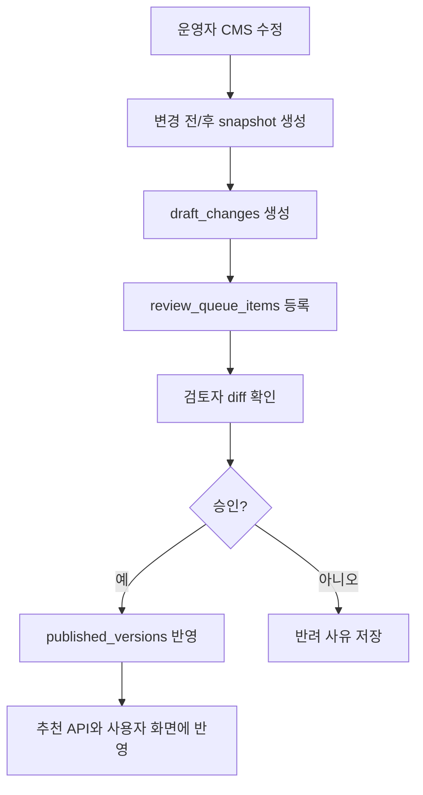

# 13. 자금안내 서류가이드 운영모델

> 적용 상태 (`2026-09-17`): 링크·서류의 내용과 확인 기준은 대화형 답변에도 적용한다. 전용 CMS 화면은 후속 범위이며, 초기에는 승인된 Snowflake 데이터에서 서류와 공식 안내 링크를 조회한다. 현재 구현 순서는 [15_대화형_정책자금_안내_전환계획.md](15_대화형_정책자금_안내_전환계획.md)를 따른다.

정책자금 추천 서비스에서 자금 소개 링크, 신청방법 안내 링크, 서류 발급 안내를 CMS로 어떻게 관리할지 정의한 문서입니다.

이 문서는 추천 규칙 자체를 정의하는 문서가 아닙니다. 추천 결과 화면과 상세 페이지에 붙는 `운영 콘텐츠`를 누가, 어떤 화면에서, 어떤 상태값으로 수정하고, 어떻게 검토/승인 후 게시할지 정리합니다.

## 문서 개요

| 항목 | 내용 |
| --- | --- |
| 기준일 | `2026-05-11` |
| 주 독자 | 관리자 화면 기획자, 백엔드 개발자, 프론트엔드 개발자, 운영 담당자 |
| 연결 문서 | [07_서류안내_규칙정의.md](/Users/jeehun/Documents/GitHub/Government-backed funding/docs/07_서류안내_규칙정의.md), [08_추천_API_응답정의.md](/Users/jeehun/Documents/GitHub/Government-backed funding/docs/08_추천_API_응답정의.md), [10_DB_스키마_초안.md](/Users/jeehun/Documents/GitHub/Government-backed funding/docs/10_DB_스키마_초안.md), [11_관리자_검토모델.md](/Users/jeehun/Documents/GitHub/Government-backed funding/docs/11_관리자_검토모델.md), [12_문서파싱_변경감지_전략.md](/Users/jeehun/Documents/GitHub/Government-backed funding/docs/12_문서파싱_변경감지_전략.md) |

## 1. 운영모델이 필요한 이유

추천 결과가 맞더라도 자금 소개 링크나 서류 발급방법이 틀리면 사용자는 실제 신청 준비 단계에서 막힌다. 특히 정책자금은 특정 기간에만 신청을 받는 경우가 많으므로, 서비스가 직접 `신청하기` 버튼을 제공하기보다 해당 자금이 무엇인지, 어디에서 신청 안내를 확인하는지, 신청 방법은 어떻게 되는지를 정확히 안내하는 것이 안전하다.

- 자금별 소개 페이지나 공식 안내 위치가 바뀔 수 있다.
- 신청기간, 접수 방식, 예약 여부는 공고 시점마다 달라질 수 있다.
- 자금별 상세 안내 페이지 URL이 바뀔 수 있다.
- 서류 발급처, 발급방법, 온라인/오프라인 경로가 바뀔 수 있다.
- 정부24, 인터넷등기소, 소상공인정책자금 사이트 같은 외부 링크가 일시적으로 죽을 수 있다.
- 사용자에게 보이는 문구는 단순 CMS 수정이어도 추천 결과 신뢰도에 직접 영향을 준다.
- 운영자가 수정한 내용은 바로 게시하지 않고 관리자 검토모델을 거쳐야 한다.

따라서 CMS는 `쉽게 수정할 수 있는 화면`이면서 동시에 `잘못 수정해도 바로 사용자에게 나가지 않는 안전장치`가 되어야 한다.

## 2. 적용 범위

### MVP 1차 필수

| 범위 | 설명 |
| --- | --- |
| 자금 소개/신청방법 안내 링크 관리 | 자금별 소개 URL, 공고문 URL, 신청방법 안내 URL, 상태값 관리 |
| 자금 상세 링크 관리 | 추천 카드의 `[상세보기]`가 연결될 내부 상세 페이지 slug 또는 외부 안내 URL 관리 |
| 서류 카탈로그 관리 | 문서명, 발급처, 발급방법, 제출 시점, 자동확인 여부 관리 |
| 서류 발급 가이드 관리 | 서류별 발급 단계, 온라인 발급 URL, 오프라인 안내, 주의사항 관리 |
| 검증 상태 관리 | 링크와 가이드의 마지막 확인일, 확인자, 상태값 관리 |
| 초안/승인 연결 | 수정 내용은 `draft_changes`와 `review_queue_items`로 연결 |

### 2차로 미뤄도 되는 범위

| 범위 | 미뤄도 되는 이유 |
| --- | --- |
| 자동 링크 헬스체크 | MVP는 수동 확인일과 상태 관리로 시작 가능 |
| 링크 변경 알림 자동화 | 관리자 대시보드 표시로 먼저 충분 |
| 다국어 콘텐츠 | 국내 정책자금 MVP에서는 한국어 우선 |
| 발급 화면 캡처 이미지 관리 | 초기에는 텍스트 단계 안내로 충분 |
| 서류 양식 파일 다운로드 관리 | 실제 양식 파일 버전 관리가 필요해지면 별도 확장 |

## 3. CMS에서 관리할 콘텐츠 구분

CMS는 같은 관리자 메뉴 안에 두더라도 `자금 안내 콘텐츠`와 `서류 안내 콘텐츠`를 분리해서 관리한다. 두 콘텐츠는 사용자 화면에서 붙어 보일 수 있지만, 작성 기준과 필수 입력값이 다르기 때문이다.

| content_type | 콘텐츠 | 사용자 화면 위치 | 기준 테이블 | 관리자 수정 필요성 |
| --- | --- | --- | --- | --- |
| `fund_content` | 자금 소개 링크 | 추천 결과 카드, 자금 상세 페이지 | `application_links` | 높음 |
| `fund_content` | 신청방법 안내 링크 | 자금 상세 페이지, 참고 링크 | `application_links` | 높음 |
| `fund_content` | 자금 상세 설명 | 추천 카드 토글, 상세 페이지 | `fund_detail_sections`, `funds` | 중간 |
| `document_content` | 서류 기본정보 | 맞춤 제출서류 토글 | `document_catalog` | 높음 |
| `document_content` | 서류 발급방법 | 서류 발급방법 상세 화면 | `document_guides` | 높음 |
| `document_content` | 서류 외부 링크 | 서류 발급방법 상세 화면 | `document_guides` | 높음 |

추천 조건과 서류 조합 규칙은 [06_추천규칙_데이터모델.md](/Users/jeehun/Documents/GitHub/Government-backed funding/docs/06_추천규칙_데이터모델.md), [07_서류안내_규칙정의.md](/Users/jeehun/Documents/GitHub/Government-backed funding/docs/07_서류안내_규칙정의.md)를 기준으로 관리한다. `13`은 그 결과에 붙는 설명, 링크, 발급방법 운영 기준을 담당한다.

### 3.1 CMS 탭 구분

| 탭 | 관리 대상 | 대표 필드 |
| --- | --- | --- |
| 자금 안내 CMS | 정책자금 소개, 자금 상세 설명, 신청방법 안내, 공고문 링크 | 자금명, 세부유형, 운영기관, 수행기관, 링크 유형, URL, 검증일 |
| 서류 안내 CMS | 서류명, 발급처, 발급방법, 온라인 발급 URL, 제출 시점 | 문서명, 발급처, 발급방법, 제출 시점, 자동확인 여부, 검증일 |

관리자 목록 화면에는 최소한 `콘텐츠 유형` 열을 둔다. 값은 `자금 안내` 또는 `서류 안내`로 표시한다.

### 3.2 업로드 화면 구분

파일 업로드 화면도 `자금 안내 업로드`와 `서류 안내 업로드`를 분리한다. 업로드 화면이 분리되어 있으면 AI가 같은 문서를 보더라도 어떤 기준으로 메타데이터를 뽑아야 하는지 명확해지고, 운영자도 잘못된 칸에 정보를 넣을 가능성이 줄어든다.

| 업로드 화면 | 업로드 대상 | AI가 우선 추출할 메타데이터 | 운영자가 직접 입력/수정할 수 있는 메타데이터 |
| --- | --- | --- | --- |
| 자금 안내 업로드 | 공고문, 자금 신청 안내자료, 자금 소개 PDF | 자금명, 세부유형, 운영기관, 수행기관, 링크 유형, URL, 신청방법 문구 | 모든 추출값 수정 가능 |
| 서류 안내 업로드 | 서류 발급방법 안내, 제출서류 안내, 서식 안내 | 문서명, 발급처, 발급방법, 제출 시점, 온라인 발급 URL, 주의사항 | 모든 추출값 수정 가능 |

AI 추출값은 자동 게시하지 않는다. 업로드 후에는 `AI 추출값 -> 운영자 확인/수정 -> 검토 요청 -> 승인/게시` 순서로 처리한다.

## 4. 자금 안내 링크 운영 기준

### 4.1 링크 유형

| channel_type | 의미 | 화면 표시 예시 |
| --- | --- | --- |
| `fund_overview` | 자금 소개 또는 대표 안내 페이지 | `자금 소개 보기` |
| `notice` | 공고문 또는 상세 안내 페이지 | `공고문 보기` |
| `application_guide` | 신청 가능 위치와 신청 방법을 안내하는 페이지 | `신청방법 확인` |
| `education` | 교육 이수 또는 사전교육 안내 페이지 | `교육 안내 보기` |
| `document_download` | 신청서식 또는 확인서식 안내/다운로드 페이지 | `서식 확인` |
| `other` | 기타 참고 링크 | `참고 링크` |

### 4.2 링크 상태값

| link_status | 의미 | 사용자 화면 처리 |
| --- | --- | --- |
| `active` | 최근 확인 기준 정상 접속 가능 | 링크 노출 |
| `checking` | 확인 중이거나 변경 가능성이 있음 | 링크는 노출하되 `확인 중` 안내 표시 |
| `inactive` | 접속 불가 또는 종료 링크 | 링크 비활성화, 운영 안내 표시 |
| `archived` | 과거 버전 보관용 | 사용자 화면 미노출 |

`inactive` 링크는 사용자 화면에서 단순히 숨기기보다 “현재 공식 안내 링크 확인 중입니다” 같은 안내를 보여주는 편이 좋다. 사용자가 기능이 없는 것으로 오해하지 않게 하기 위해서다.

### 4.3 자금 안내 링크 필수 입력값

| 항목 | 설명 | 필수 여부 |
| --- | --- | --- |
| 콘텐츠 유형 | `자금 안내`로 고정 | 필수 |
| 자금명 | 링크가 속한 자금 | 필수 |
| 세부유형 | 특정 세부유형 전용 링크인 경우 | 선택 |
| 운영기관 | 자금을 총괄하거나 공고를 내는 기관 | 필수 |
| 수행기관 | 실제 접수, 상담, 집행을 담당하는 기관 | 선택 |
| 링크 유형 | `fund_overview`, `notice`, `application_guide` 등 | 필수 |
| URL | 실제 연결 주소 | 필수 |
| 링크 라벨 | 사용자에게 보이는 링크명 | 필수 |
| 상태 | `active`, `checking`, `inactive`, `archived` | 필수 |
| 마지막 확인일 | 운영자가 링크를 확인한 일시 | 필수 |
| 확인자 | 링크를 확인한 관리자 | 필수 |
| 공식 근거 | 공고문, 안내자료, 공식 사이트 확인 메모 | 권장 |
| 비고 | 운영 메모 | 선택 |

기관은 사용자에게 “어디서 확인하고 신청 준비를 해야 하는지”를 알려주는 핵심 정보다. 예를 들어 정책자금 총괄 기관과 실제 접수 사이트가 다를 수 있으므로 `운영기관`과 `수행기관`을 분리한다.

| 기관 필드 | 의미 | 예시 |
| --- | --- | --- |
| 운영기관 | 자금 정책을 공고하거나 총괄하는 기관 | 중소벤처기업부 |
| 수행기관 | 신청 안내, 접수, 상담, 집행을 담당하는 기관 | 소상공인시장진흥공단 |

## 5. 서류 가이드 운영 기준

### 5.1 서류 기본정보

서류 기본정보는 사용자 결과 화면의 `맞춤 제출서류 보기` 토글에 노출되는 내용이다.

| 항목 | 설명 | 예시 |
| --- | --- | --- |
| 콘텐츠 유형 | `서류 안내`로 고정 | `서류 안내` |
| `doc_code` | 내부 고정 코드 | `business_lease_contract` |
| 문서명 | 사용자에게 보이는 서류명 | `사업장 임대차계약서` |
| 발급처 | 발급 또는 보유 주체 | `임대인·임차인 보유 계약서` |
| 발급방법 요약 | 결과 카드에서 보이는 짧은 설명 | `체결한 계약서 사본 제출` |
| 제출 시점 | `신청 시 작성`, `자동확인`, `기본 제출 권장`, `심사 후 또는 필요 시 제출` | `기본 제출 권장` |
| 자동확인 여부 | 공공마이데이터 또는 행정정보 공동이용 우선 여부 | `false` |
| 사용자 노출 여부 | 현재 결과 화면에 보여줄지 여부 | `true` |

### 5.2 발급방법 상세 가이드

발급방법 상세 가이드는 사용자가 서류명을 클릭하거나 `[발급방법 보기]`를 눌렀을 때 보여주는 내용이다.

| 항목 | 설명 |
| --- | --- |
| 한 줄 요약 | 서류 준비 방식의 핵심 안내 |
| 온라인 발급 가능 여부 | 온라인 발급 가능, 일부 가능, 불가, 확인 필요 |
| 온라인 발급 URL | 정부24, 인터넷등기소, 고용산재보험 토탈서비스 등 |
| 오프라인 발급 안내 | 방문 발급처, 무인발급기, 관할 기관 등 |
| 준비물 | 인증서, 사업자번호, 대표자 정보 등 |
| 발급 수수료 안내 | 무료, 유료, 기관별 상이 등 |
| 유효기간 안내 | 1개월 이내 등 필요한 경우 |
| 주의사항 | 주된 사업장 기준, 공동대표 각각 필요 등 |
| 마지막 검증일 | 운영자가 실제 내용을 확인한 일자 |

### 5.3 서류 가이드 작성 원칙

- 사용자가 이해할 수 있는 말로 쓴다.
- `제출해야 함`과 `자동확인 가능`을 섞어 쓰지 않는다.
- 공공마이데이터로 우선 확인되는 항목은 `자동확인`으로 안내한다.
- 직접 제출이 필요한 서류만 사용자가 준비할 서류처럼 보여준다.
- 발급처가 불명확한 서류는 `사업자 보유`, `계약 당사자 보유`, `별도 발급처 없음`처럼 현실적인 표현을 쓴다.
- 법정 서류명과 사용자 친화적 서류명이 다르면 사용자 화면에는 쉬운 이름을 먼저 쓰고, 상세 설명에 공식명을 함께 쓴다.
- `주된 사업장 기준`, `공동대표 각각`, `1개월 이내` 같은 실무 문구는 주의사항으로 분리한다.

## 6. 관리자 CMS 화면 구성

### 6.1 자금 안내 CMS 목록

| 화면 항목 | 설명 |
| --- | --- |
| 콘텐츠 유형 | `자금 안내`로 표시 |
| 자금명 필터 | 특정 자금 링크만 보기 |
| 운영기관 필터 | 중소벤처기업부, 소상공인시장진흥공단 등 기관 기준 필터 |
| 수행기관 필터 | 접수/상담/집행 기관 기준 필터 |
| 링크 유형 필터 | 자금 소개, 공고문, 신청방법 안내, 교육 안내, 서식 안내 |
| 상태 필터 | 정상, 확인 중, 비활성, 보관 |
| 마지막 확인일 | 오래된 링크 우선 정렬 |
| 확인자 | 마지막으로 검증한 관리자 |
| 미리보기 | 사용자 화면 링크 라벨과 URL 확인 |
| 수정 버튼 | 수정 시 바로 게시하지 않고 초안 생성 |

### 6.2 자금 안내 CMS 상세/수정

| 구역 | 입력 항목 |
| --- | --- |
| 기본정보 | 콘텐츠 유형, 자금명, 세부유형, 운영기관, 수행기관 |
| 링크 정보 | 링크 유형, 링크 라벨, URL, URL 설명, 새 창 열기 여부 |
| 상태 관리 | 상태, 마지막 확인일, 확인자, 확인 메모 |
| 노출 설정 | 사용자 노출 여부, 표시 순서 |
| 검토 요청 | 변경 사유, 공식 근거, 검토 요청 버튼 |

### 6.2.1 자금 안내 업로드 화면

자금 안내 업로드 화면은 파일을 올리면서 메타데이터를 함께 입력하거나, 업로드 후 AI가 추출한 값을 운영자가 확인하는 화면이다.

| 입력 항목 | 기본 동작 | 운영자 수정 가능 여부 |
| --- | --- | --- |
| 콘텐츠 유형 | `자금 안내`로 고정 | 불가 |
| 파일 | PDF 우선 업로드 | 가능 |
| 자금명 | AI 자동 추출 또는 운영자 선택 | 가능 |
| 세부유형 | AI 자동 추출 또는 운영자 선택 | 가능 |
| 운영기관 | AI 자동 추출 또는 운영자 입력 | 가능 |
| 수행기관 | AI 자동 추출 또는 운영자 입력 | 가능 |
| 링크 유형 | AI가 `자금 소개`, `공고문`, `신청방법 안내` 후보를 제안 | 가능 |
| URL | 문서 안 URL 자동 추출 또는 운영자 입력 | 가능 |
| 상태 | 기본 `확인 중` | 가능 |
| 마지막 확인일 | 운영자가 확인하면 현재일로 입력 | 가능 |

AI가 값을 찾지 못한 칸은 빈 값으로 두고 `수동 입력 필요` 표시를 한다. 운영자가 필수값을 채우기 전에는 검토 요청을 보낼 수 없게 한다.

### 6.3 서류 안내 CMS 목록

| 화면 항목 | 설명 |
| --- | --- |
| 콘텐츠 유형 | `서류 안내`로 표시 |
| 문서명 검색 | 서류명 또는 `doc_code`로 검색 |
| 제출 시점 필터 | 자동확인, 기본 제출 권장, 심사 보강 등 |
| 발급처 필터 | 정부24, 인터넷등기소, 은행, 사업자 보유 등 |
| 온라인 발급 여부 | 온라인 가능 여부로 필터 |
| 마지막 검증일 | 오래된 가이드 우선 정렬 |
| 노출 여부 | 사용자 화면 노출/숨김 상태 |

### 6.4 서류 안내 CMS 상세/수정

| 구역 | 입력 항목 |
| --- | --- |
| 기본정보 | 콘텐츠 유형, 문서명, 발급처, 발급방법 요약, 제출 시점 |
| 상세 안내 | 한 줄 요약, 온라인/오프라인 발급방법, 준비물, 수수료 |
| 링크 관리 | 온라인 발급 URL, 참고 URL, 링크 상태 |
| 주의사항 | 유효기간, 주된 사업장 기준, 공동대표 적용 여부 |
| 검증 정보 | 마지막 확인일, 확인자, 근거 문서 |
| 검토 요청 | 변경 사유, 검토 요청 버튼 |

### 6.4.1 서류 안내 업로드 화면

서류 안내 업로드 화면은 서류 발급방법이나 제출서류 안내 자료를 올리고, AI가 서류 메타데이터를 추출하도록 하는 화면이다.

| 입력 항목 | 기본 동작 | 운영자 수정 가능 여부 |
| --- | --- | --- |
| 콘텐츠 유형 | `서류 안내`로 고정 | 불가 |
| 파일 | PDF 우선 업로드 | 가능 |
| 문서명 | AI 자동 추출 또는 운영자 입력 | 가능 |
| 발급처 | AI 자동 추출 또는 운영자 입력 | 가능 |
| 발급방법 요약 | AI 자동 추출 또는 운영자 입력 | 가능 |
| 제출 시점 | AI가 후보 제안. 예: 기본 제출 권장, 심사 후 제출 | 가능 |
| 자동확인 여부 | AI가 후보 제안. 운영자 확인 필요 | 가능 |
| 온라인 발급 URL | 문서 안 URL 자동 추출 또는 운영자 입력 | 가능 |
| 주의사항 | AI 자동 추출 또는 운영자 입력 | 가능 |
| 마지막 확인일 | 운영자가 확인하면 현재일로 입력 | 가능 |

서류 안내 업로드에서는 자금명, 운영기관, 수행기관을 필수로 받지 않는다. 같은 서류가 여러 자금에서 공통으로 쓰일 수 있기 때문이다.

## 7. 수정/승인 흐름

CMS에서 운영자가 내용을 수정해도 사용자 화면에는 바로 반영하지 않는다. 모든 변경은 [11_관리자_검토모델.md](/Users/jeehun/Documents/GitHub/Government-backed funding/docs/11_관리자_검토모델.md)의 초안/검토/승인/게시 흐름을 따른다.

### 7.1 바로 저장 가능한 것과 검토가 필요한 것

| 변경 내용 | 처리 |
| --- | --- |
| 운영자 개인 메모 | 바로 저장 가능 |
| 마지막 확인일만 갱신 | 바로 저장 가능 또는 간단 승인 |
| 링크 URL 변경 | 검토 필수 |
| 링크 상태를 `inactive`로 변경 | 검토 필수 |
| 서류명 변경 | 검토 필수 |
| 발급처/발급방법 변경 | 검토 필수 |
| 제출 시점 변경 | 검토 필수 |
| 사용자 노출 여부 변경 | 검토 필수 |

MVP에서는 구현을 단순하게 하기 위해 사용자 노출 콘텐츠 변경은 전부 검토 대상으로 처리한다. 운영자 메모, 확인일 갱신처럼 사용자에게 보이지 않는 값만 즉시 저장 가능하게 둔다.

## 8. 사용자 화면 반영 기준

### 8.1 추천 결과 카드

추천 결과 카드에는 아래 정보를 노출한다.

- 추천 자금명
- 간략 추천 이유
- 자금 소개 토글
- `[상세보기]` 링크
- `[맞춤 제출서류 보기]` 토글
- 신청방법 안내 링크 또는 공식 안내 링크 확인 중 안내

### 8.2 맞춤 제출서류 토글

서류 목록에는 아래 정보를 우선 노출한다.

| 항목 | 노출 방식 |
| --- | --- |
| 문서명 | 항상 노출 |
| 발급처 | 항상 노출 |
| 발급방법 요약 | 항상 노출 |
| 제출 시점 | 배지 또는 작은 라벨로 노출 |
| 자동확인 여부 | `공공마이데이터 또는 행정정보 공동이용으로 우선 확인` 문구 |
| 상세 발급방법 | `[발급방법 보기]` 링크로 연결 |

### 8.3 자금 상세 페이지

자금명을 누른 뒤 간단 토글을 보고, `[상세보기]`를 누르면 자금 상세 페이지로 이동한다. 상세 페이지는 `fund_detail_sections`와 `application_links`를 조합해 표시한다.

| 구역 | 내용 |
| --- | --- |
| 자금 소개 | 한 문단 요약 |
| 기관 정보 | 운영기관과 수행기관 |
| 지원대상 | 대상 조건 설명 |
| 특징 | 금리, 한도, 대상 업종 등 핵심 특징 |
| 유의사항 | 제한 조건, 확인 필요 조건 |
| 신청방법 안내 | 현재 활성 상태의 자금 소개 또는 신청방법 안내 링크 |
| 관련 서류 | 해당 자금에서 자주 필요한 서류 가이드 링크 |

## 9. 데이터 연결 기준

| 운영 대상 | DB 기준 | 검토 도메인 |
| --- | --- | --- |
| 자금 소개/신청방법 안내 링크 | `application_links` | `application_link` |
| 자금 상세 설명 | `funds`, `fund_detail_sections` | `fund_detail` |
| 서류 기본정보 | `document_catalog` | `document_guide` |
| 서류 발급방법 | `document_guides` | `document_guide` |
| 서류 조합 규칙 | `document_requirement_rules` | `document_rule` |

서류 조합 규칙은 “언제 어떤 서류를 보여줄지”를 정한다. 서류 가이드 CMS는 “그 서류를 어떻게 발급받고 준비할지”를 정한다. 두 영역은 붙어 있지만 역할이 다르므로 관리자 화면에서도 탭을 분리하는 편이 좋다.

`application_links`는 자금 안내 콘텐츠만 저장한다. `document_guides`는 서류 안내 콘텐츠만 저장한다. 같은 외부 URL이라도 자금 공고문이면 `application_links`, 서류 발급처 안내면 `document_guides`에 저장한다.

## 10. API 설계 메모

### 10.1 사용자 API

| Method | URL | 설명 |
| --- | --- | --- |
| `GET` | `/api/funds/{fund_code}` | 자금 상세 설명과 신청방법 안내 링크 조회 |
| `GET` | `/api/documents/{doc_code}/guide` | 서류 발급방법 상세 조회 |

사용자 API는 게시 완료된 버전만 읽는다. `draft`, `in_review`, `rejected` 상태의 CMS 변경 내용은 사용자에게 노출하지 않는다.

### 10.2 관리자 API

| Method | URL | 설명 |
| --- | --- | --- |
| `GET` | `/admin/application-links` | 자금 소개/신청방법 안내 링크 목록 조회 |
| `GET` | `/admin/application-links/{link_id}` | 자금 소개/신청방법 안내 링크 상세 조회 |
| `POST` | `/admin/application-links` | 자금 소개/신청방법 안내 링크 신규 초안 생성 |
| `PATCH` | `/admin/application-links/{link_id}` | 자금 소개/신청방법 안내 링크 수정 초안 생성 |
| `POST` | `/admin/application-links/{link_id}/verify` | 마지막 확인일, 확인자, 확인 메모 갱신 |
| `GET` | `/admin/document-guides` | 서류 가이드 목록 조회 |
| `GET` | `/admin/document-guides/{doc_code}` | 서류 가이드 상세 조회 |
| `PATCH` | `/admin/document-guides/{doc_code}` | 서류 가이드 수정 초안 생성 |

관리자 API에서 사용자 노출 콘텐츠를 바꾸는 요청은 원본 테이블을 바로 수정하지 않고 `draft_changes`를 생성한다.

## 11. 링크 검증 기준

### 11.1 수동 검증

MVP에서는 운영자가 링크를 직접 열어보고 `마지막 확인일`을 갱신하는 방식으로 시작한다.

| 검증 결과 | 처리 |
| --- | --- |
| 정상 접속 | `link_status = active` |
| 접속은 되지만 공고가 바뀐 듯함 | `link_status = checking` |
| 404, 만료, 폐쇄 | `link_status = inactive` |
| 과거 보관용 | `link_status = archived` |

### 11.2 자동 검증

2차에서는 정기 작업으로 HTTP 상태코드, 리다이렉트, 응답 시간 정도를 확인할 수 있다. 단, 정부 사이트는 봇 차단이나 세션 요구가 있을 수 있으므로 자동 검증 결과만으로 `inactive` 처리하지 않는다.

- 자동 검증 실패는 `checking`으로 보내고 운영자 확인을 요청한다.
- 자동 검증 성공은 참고값으로만 사용한다.
- 자금 안내 링크의 최종 유효성 판단은 운영자 확인일 기준으로 남긴다.

## 12. 오류/예외 처리

| 상황 | 사용자 화면 처리 | 관리자 화면 처리 |
| --- | --- | --- |
| 자금 안내 링크 없음 | `공식 안내 링크 확인 중` 안내 | 링크 등록 필요 배지 |
| 링크 상태 `checking` | 링크 노출 + 확인 중 안내 | 우선 검증 대상 표시 |
| 링크 상태 `inactive` | 링크 비활성화 또는 숨김 + 안내문 | 수정 또는 보관 처리 요청 |
| 서류 발급방법 없음 | 기본 서류명/발급처만 노출 | 가이드 미작성 배지 |
| 외부 URL 형식 오류 | 사용자 화면 미노출 | 저장 전 validation 오류 |
| 승인 전 초안 존재 | 게시 버전 기준으로 사용자 노출 | 검토 대기 배지 |

## 13. 권한과 감사 기준

자세한 관리자 권한, 세션, 감사로그 보관 정책은 [14_관리자_권한_감사로그_정책.md](/Users/jeehun/Documents/GitHub/Government-backed funding/docs/14_관리자_권한_감사로그_정책.md)를 따른다. 이 문서에서는 CMS 운영에 필요한 최소 역할만 요약한다.

| 역할 | 가능 작업 |
| --- | --- |
| `operator` | 링크/서류 가이드 초안 생성, 확인일 갱신, 검토 요청 |
| `reviewer` | 초안 승인/반려, 수정 요청 |
| `admin` | 게시, 롤백, 긴급 비활성화, 권한 관리 |

감사 로그에는 최소 아래 정보가 남아야 한다.

- 변경 대상
- 변경 전 값
- 변경 후 값
- 변경 관리자
- 검토자
- 승인/반려 시각
- 변경 사유
- 공식 근거 또는 확인 메모

## 14. 테스트 시나리오

| 시나리오 | 기대 결과 |
| --- | --- |
| 운영자가 신청방법 안내 URL 수정 | 사용자 화면에 바로 반영되지 않고 검토 대기열 생성 |
| 검토자가 URL 변경 승인 | 새 게시 버전부터 사용자 자금 상세 페이지에 반영 |
| 링크를 `inactive`로 변경 | 승인 후 사용자 화면에서 링크 비활성 또는 확인 중 안내 |
| 서류 발급방법 수정 | 검토/승인 전에는 기존 발급방법이 계속 노출 |
| 서류 가이드가 없는 서류 조회 | 기본 문서명/발급처만 보여주고 관리자에는 가이드 미작성 표시 |
| 마지막 확인일만 갱신 | 사용자 문구는 그대로 유지되고 운영 검증일만 갱신 |
| 자동 링크 검증 실패 | 바로 비활성화하지 않고 `checking` 후보로 표시 |
| 롤백 실행 | 이전 게시 버전의 링크와 서류 가이드로 복구 |

## 15. 구현 주의사항

- CMS 수정은 편해야 하지만 게시는 신중해야 한다.
- 사용자 화면은 항상 게시 완료된 콘텐츠만 읽는다.
- 링크 URL, 발급방법, 제출 시점 변경은 추천 결과 신뢰도에 영향을 주므로 검토 대상으로 둔다.
- 링크 자동 검증 결과만으로 사용자 안내 링크를 숨기지 않는다.
- 서류 가이드 CMS와 서류 조합 규칙 편집기는 같은 화면에 두더라도 탭을 분리한다.
- `doc_code`, `fund_code`, `variant_code` 같은 내부 코드는 운영자가 실수로 바꾸지 못하게 읽기 전용으로 두는 편이 안전하다.
- 외부 URL은 저장 전 형식 검증을 하고, 사용자 화면에서는 새 창 열기와 외부 사이트 안내를 제공한다.
- 공공마이데이터로 확인 가능한 항목은 “서류 제출”처럼 보이지 않게 문구를 분리한다.
