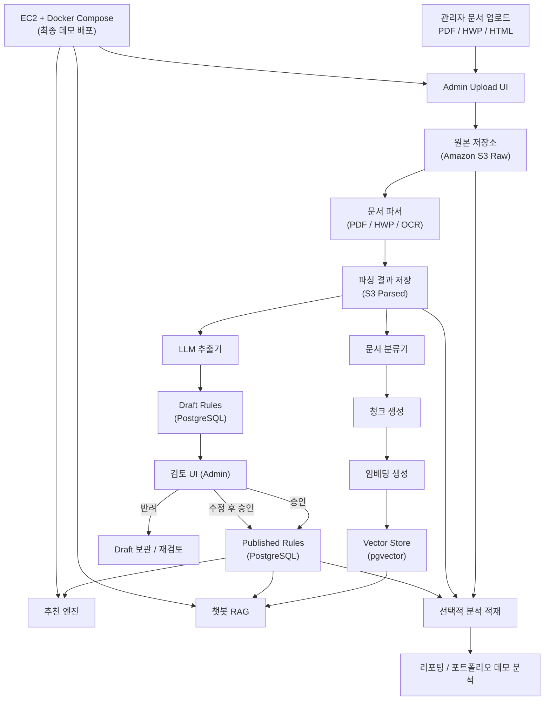

# System Architecture

## Notes

- 문서는 크롤링이 아니라 관리자가 직접 업로드하는 MVP 기준입니다.
- Amazon S3는 원본 문서와 파싱 결과를 보관하는 저장소입니다.
- PostgreSQL은 Draft / Published Rules와 추천 서비스 운영 데이터의 기준 저장소입니다.
- pgvector는 챗봇 RAG와 문서 근거 검색을 위한 벡터 저장소입니다.
- EC2는 최종 데모 배포용 런타임으로만 사용하며, 평소에는 인스턴스를 꺼둘 수 있습니다.
- 분석 계층은 선택 사항이며, 포트폴리오 MVP에서는 필수는 아닙니다.
