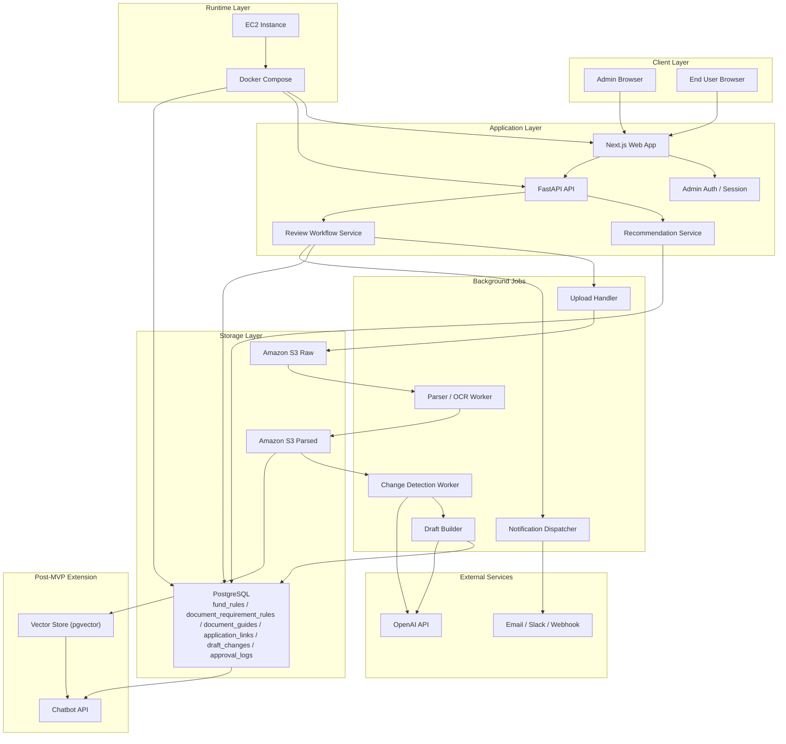

# Technical Architecture

## Recommended Stack

- Frontend / Admin Console: Next.js
- Backend API: FastAPI
- Background Processing: Worker process for parsing, OCR, AI extraction, change detection, notification dispatch
- Operational Database: PostgreSQL
- Object Storage: Amazon S3
- LLM Processing: OpenAI API
- Admin Authentication: session-based admin auth
- Notification Channel: Email, Slack, or webhook
- Runtime: Docker Compose
- Final Demo Deployment: Amazon EC2
- Post-MVP Optional: pgvector for chatbot RAG

## Core Data Domains

- `source_documents`: 업로드 원본 문서 메타데이터
- `parsed_documents`: 파싱 또는 정규화 결과 메타데이터
- `draft_changes`: AI가 제안한 규칙, 서류, 링크 변경 초안
- `fund_rules`: 승인된 정책자금 규칙
- `document_requirement_rules`: 자금과 사용자 조건 기반 필요 서류 매핑
- `document_guides`: 서류 발급 방법 콘텐츠
- `application_links`: 자금별 외부 신청 딥링크와 신청 채널 정보
- `approval_logs`: 승인, 반려, 수정 이력
- `recommendation_request_logs`: 필요 시 구간화된 사용자 입력 로그만 저장하는 선택적 도메인

## Architecture Diagram

## Component Responsibilities

### 1. Next.js Web App

- `S1` ~ `S5` 사용자 화면 제공
- 관리자 문서 업로드 화면 제공
- 관리자 검토 및 승인 화면 제공
- 서류 발급 가이드 CMS 화면 제공

### 2. Admin Auth / Session

- 로그인한 관리자만 운영 기능에 접근하도록 보호
- 관리자 세션 검증 및 권한 확인

### 3. FastAPI API

- 사용자 추천 요청 수신
- 관리자 업로드 및 검토 요청 처리
- 추천 서비스와 워크플로우 서비스 오케스트레이션

### 4. Recommendation Service

- 승인된 운영 데이터만 조회
- 자금별 `적합`, `근사 부적합`, `부적합` 판정 계산
- 우선순위, 추천 근거, 필요 서류, 딥링크 조합

### 5. Review Workflow Service

- 문서 업로드 이후 파이프라인 시작
- 변경 초안 생성 및 검토 큐 관리
- 승인, 반려, 수정 후 승인 처리

### 6. Background Jobs

- 문서 저장, 파싱, OCR 수행
- LLM 기반 구조화 추출과 변경 감지 수행
- 검토 알림 발송

### 7. PostgreSQL

- 운영 규칙과 서류 도메인의 기준 저장소
- 초안 변경안과 승인 이력 저장
- 필요 시 구간화된 추천 요청 로그 저장

### 8. Amazon S3

- 원본 문서와 파싱 결과 저장
- 재처리와 재검토를 위한 장기 보관 계층

### 9. OpenAI API

- 문서 기반 구조화 추출
- 기존 운영 규칙과의 변경 차이 보조 판단
- 챗봇 도입 시 응답 생성에 재사용 가능

## Main Flows

### A. 문서 업로드와 승인 반영

1. 관리자가 문서를 업로드한다.
2. Upload Handler가 원본 문서를 S3 Raw에 저장한다.
3. Parser / OCR Worker가 문서를 파싱해 S3 Parsed에 저장한다.
4. Change Detection Worker가 기존 운영 데이터와 비교한다.
5. Draft Builder가 변경 초안을 만들어 PostgreSQL에 기록한다.
6. Notification Dispatcher가 관리자에게 검토 요청을 보낸다.
7. 관리자가 승인하면 운영 데이터에 반영한다.

### B. 사용자 자금 추천

1. 사용자가 기업 정보를 선택 또는 검색으로 입력한다.
2. FastAPI가 Recommendation Service에 구조화된 입력값을 전달한다.
3. Recommendation Service가 승인된 `fund_rules`, `document_requirement_rules`, `document_guides`, `application_links`를 조회한다.
4. 자금별 판정 상태, 우선순위, 추천 근거, 필요 서류, 신청 링크를 계산해 반환한다.

### C. 챗봇 확장

1. `MVP 이후` 챗봇이 필요해지면 pgvector와 Chatbot API를 추가한다.
2. 챗봇은 승인된 운영 데이터와 문서 임베딩을 함께 조회한다.
3. 사용자에게 설명형 답변과 근거를 제공한다.

## Design Decisions

- 운영 소스 오브 트루스는 승인된 운영 데이터다.
- 업로드 문서 기반 초안과 직접 관리자 수정 모두 검토 큐를 거친 뒤 반영한다.
- `정책자금 규칙`, `필요 서류 규칙`, `서류 가이드`, `신청 링크`는 분리된 도메인으로 관리한다.
- `신용점수`, `기대출` raw 값은 MVP 기본 저장 대상에서 제외한다.
- 장시간 실행되는 파싱, AI 추출, 변경 감지는 동기 API가 아니라 백그라운드 작업으로 처리하는 편이 안정적이다.
- 챗봇과 RAG 저장소는 MVP의 필수 구성요소가 아니라 후속 확장으로 둔다.
