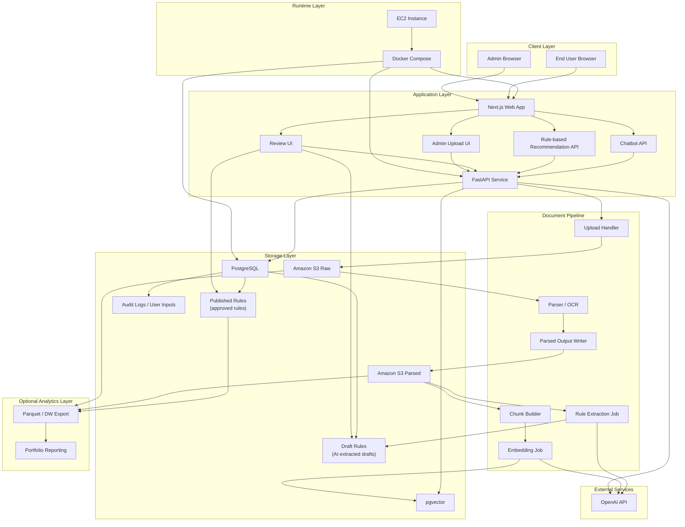

# Technical Architecture

## Recommended Stack

- Frontend / BFF: Next.js
- Backend Processing: FastAPI
- Operational Database: PostgreSQL
- Vector Search: pgvector
- Object Storage: Amazon S3
- LLM / Embeddings: OpenAI API
- Runtime: Docker Compose
- Final Demo Deployment: Amazon EC2
- Analytics: Optional only

## Architecture Diagram

## Diagram Notes

- `Amazon S3 Raw`: 업로드된 원본 PDF / HWP / HTML을 보관하는 계층
- `Amazon S3 Parsed`: 파싱 후 정제된 텍스트와 중간 산출물을 저장하는 계층
- `Draft Rules`: LLM이 추출한 초안 규칙. 아직 추천에 직접 사용하지 않음
- `Published Rules`: 관리자 검토 후 승인된 규칙. 상태 선택형 추천에서 직접 조회
- `Rule-based Recommendation API`: 사용자가 클릭/선택한 상태값으로 결과를 계산하는 1차 MVP 기능
- `Chatbot API`: FastAPI가 pgvector와 Published Rules를 함께 조회한 뒤 LLM으로 답변을 생성하는 2차 기능
- `pgvector`: 챗봇이 관련 문서 chunk를 검색하기 위한 벡터 인덱스

## Component Responsibilities

### 1. Next.js Web App

- 정책자금 소개 페이지 제공
- 관리자 문서 업로드 화면 제공
- 추천 결과 화면 제공
- 챗봇 UI 제공
- 검토 및 승인 화면 제공

### 2. FastAPI Service

- 문서 업로드 처리
- S3 파일 저장 연동
- 문서 파싱 및 후처리 오케스트레이션
- 추천 API 및 챗봇 API 제공
- Draft / Published Rules 반영 처리
- 챗봇 요청 시 PostgreSQL과 pgvector를 함께 조회하는 오케스트레이터 역할 수행

### 3. Amazon S3

- 원본 PDF / HWP / HTML 저장
- 파싱된 텍스트 결과 저장
- chunk 생성 전 중간 산출물 저장
- 재파싱 / 재임베딩 / 재검토를 위한 장기 보관 계층

### 4. PostgreSQL

- 문서 메타데이터 저장
- 자격요건 초안 저장
- 승인된 정책 규칙 저장
- 사용자 입력, 감사 로그, 검토 이력 저장

### 5. pgvector

- 문서 청크 임베딩 저장
- 챗봇 RAG 검색
- 추천 결과에 필요한 근거 탐색 보조

### 6. OpenAI API

- 임베딩 생성
- 문서 기반 자격요건 구조화 추출
- 챗봇 응답 생성

### 7. Docker Compose

- Next.js / FastAPI / PostgreSQL 실행 환경 통합
- 로컬 개발과 데모 서버 실행 환경 일치
- 면접 시 `docker compose up` 기반 재현성 제공

### 8. Amazon EC2

- 최종 데모용 배포 서버
- Docker Compose 기반으로 앱 실행
- 필요할 때만 켜고, 평소에는 중지 가능한 비용 절약형 운영

## Main Flows

### A. 문서 업로드 및 구조화

1. 관리자가 PDF / HWP / HTML 문서를 업로드한다.
2. 업로드 핸들러가 원본 문서를 S3 Raw에 저장한다.
3. 파서가 문서를 텍스트로 변환하고 파싱 결과를 S3 Parsed에 저장한다.
4. LLM이 파싱 결과에서 자격요건 후보를 추출해 Draft Rules로 저장한다.
5. 관리자가 검토 후 Published Rules로 승인한다.

### B. 사용자 자금 추천

1. 사용자가 기업 상태를 입력한다.
2. FastAPI가 PostgreSQL의 Published Rules를 조회한다.
3. 추천 엔진이 조건 매칭과 업종 기반 추론을 수행한다.
4. 추천 자금, 보완 항목, 필요 서류를 반환한다.

### C. 챗봇 RAG

1. 사용자가 질문을 입력한다.
2. FastAPI의 Chatbot API가 pgvector에서 관련 문서 청크를 검색한다.
3. 동시에 PostgreSQL의 Published Rules를 조회해 운영 규칙을 함께 가져온다.
4. 관련 청크와 Published Rules를 LLM에 전달한다.
5. 답변과 근거를 함께 반환한다.

### D. 최종 데모 배포

1. 애플리케이션을 Docker Compose로 패키징한다.
2. EC2 인스턴스에서 컨테이너를 실행한다.
3. 데모가 끝나면 EC2를 중지하고, 문서와 데이터는 S3 / PostgreSQL에 유지한다.

## Design Principles

- 업로드 문서 원본과 파싱 결과를 분리 저장한다.
- 운영 데이터는 Published Rules만 사용한다.
- AI 추출 결과는 반드시 Draft 상태를 거친다.
- 상태 선택형 추천과 챗봇형 추천은 API를 분리하되, 같은 운영 규칙을 참조한다.
- 챗봇은 FastAPI를 통해 pgvector와 PostgreSQL을 함께 조회한다.
- Docker Compose로 로컬과 데모 서버 실행 방식을 통일한다.
- EC2는 상시 운영이 아니라 포트폴리오 데모 목적의 선택적 런타임으로 사용한다.
